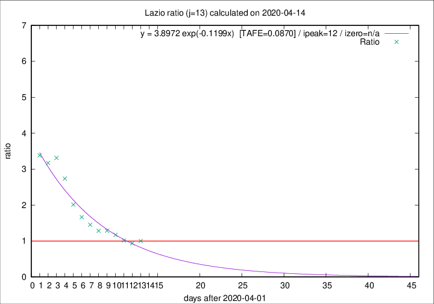

# Lazio

Data source: https://raw.githubusercontent.com/pcm-dpc/COVID-19/master/dati-json/dpc-covid19-ita-regioni.json

Delta days analysis (j): 13

Analyses for other values of j for 2020-04-14 are avalable [here](../2020-04-14/README.md)

Analyses for Lazio for previous dates are avalable [here](../README.md)

## Fitting 
|fit type|best fit equation|tafe|tfe|ipeak|izero|
|-------|-----|--------|------|---|---|
|exp|y = 3.8972 exp(-0.1199x)  [TAFE=0.0870]|0.0870|0.0062|12|n/a|

## Data
|Date|Daily deaths|Cumulated deaths|Deaths in the last 13 days|Deaths in the 13 days before|ratio|
|----|----------|-----------|-------|--------------------|-----|
|2020-04-14|16|300|131|131|1.0000|
|2020-04-13|5|284|122|130|0.9385|
|2020-04-12|6|279|129|127|1.0157|
|2020-04-11|10|273|137|117|1.1709|
|2020-04-10|10|263|139|108|1.2870|
|2020-04-09|9|253|135|105|1.2857|
|2020-04-08|6|244|138|95|1.4526|
|2020-04-07|9|238|143|86|1.6628|
|2020-04-06|10|229|149|74|2.0135|
|2020-04-05|7|219|156|57|2.7368|
|2020-04-04|13|212|159|48|3.3125|
|2020-04-03|14|199|149|47|3.1702|
|2020-04-02|16|185|142|42|3.3810|

[Download data as CSV](COVID-19_lazio_j13_2020-04-14.csv)

Generated April 16th, 2020 at 20:09:19 UTC+0200 with https://github.com/robianc/COVID-19
