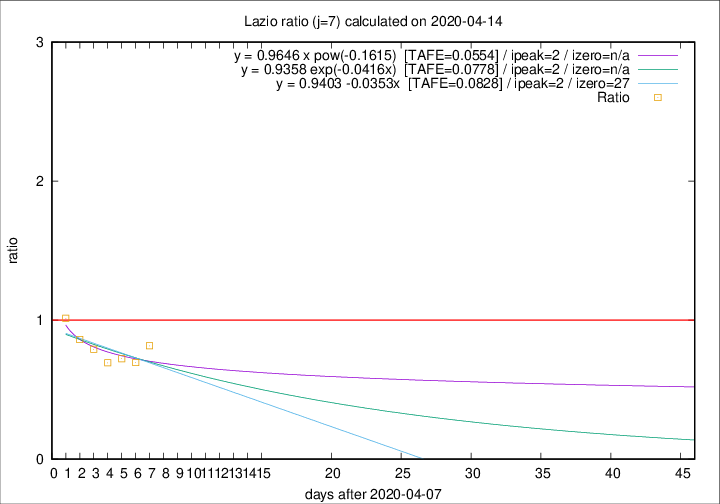

# Lazio

Data source: https://raw.githubusercontent.com/pcm-dpc/COVID-19/master/dati-json/dpc-covid19-ita-regioni.json

Delta days analysis (j): 7

Analyses for other values of j for 2020-04-14 are avalable [here](../2020-04-14/README.md)

Analyses for Lazio for previous dates are avalable [here](../README.md)

## Fitting 
|fit type|best fit equation|tafe|tfe|ipeak|izero|
|-------|-----|--------|------|---|---|
|linear|y = 0.9403 -0.0353x  [TAFE=0.0828]|0.0828|0.0093|2|27|
|exp|y = 0.9358 exp(-0.0416x)  [TAFE=0.0778]|0.0778|0.0044|2|n/a|
|pow|y = 0.9646 x pow(-0.1615)  [TAFE=0.0554]|0.0554|0.0026|2|n/a|

## Data
|Date|Daily deaths|Cumulated deaths|Deaths in the last 7 days|Deaths in the 7 days before|ratio|
|----|----------|-----------|-------|--------------------|-----|
|2020-04-14|16|300|62|76|0.8158|
|2020-04-13|5|284|55|79|0.6962|
|2020-04-12|6|279|60|83|0.7229|
|2020-04-11|10|273|61|88|0.6932|
|2020-04-10|10|263|64|81|0.7901|
|2020-04-09|9|253|68|79|0.8608|
|2020-04-08|6|244|75|74|1.0135|

[Download data as CSV](COVID-19_lazio_j7_2020-04-14.csv)

Generated April 14th, 2020 at 19:16:04 UTC+0200 with https://github.com/robianc/COVID-19
