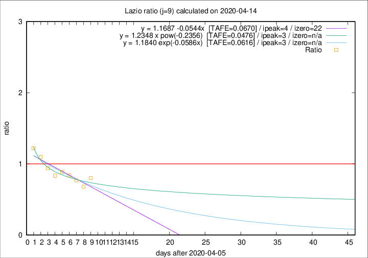

# Lazio

Data source: https://raw.githubusercontent.com/pcm-dpc/COVID-19/master/dati-json/dpc-covid19-ita-regioni.json

Delta days analysis (j): 9

Analyses for other values of j for 2020-04-14 are avalable [here](../2020-04-14/README.md)

Analyses for Lazio for previous dates are avalable [here](../README.md)

## Fitting 
|fit type|best fit equation|tafe|tfe|ipeak|izero|
|-------|-----|--------|------|---|---|
|linear|y = 1.1687 -0.0544x  [TAFE=0.0670]|0.0670|0.0061|4|22|
|exp|y = 1.1840 exp(-0.0586x)  [TAFE=0.0616]|0.0616|0.0029|3|n/a|
|pow|y = 1.2348 x pow(-0.2356)  [TAFE=0.0476]|0.0476|0.0015|3|n/a|

## Data
|Date|Daily deaths|Cumulated deaths|Deaths in the last 9 days|Deaths in the 9 days before|ratio|
|----|----------|-----------|-------|--------------------|-----|
|2020-04-14|16|300|81|101|0.8020|
|2020-04-13|5|284|72|106|0.6792|
|2020-04-12|6|279|80|104|0.7692|
|2020-04-11|10|273|88|105|0.8381|
|2020-04-10|10|263|94|106|0.8868|
|2020-04-09|9|253|91|109|0.8349|
|2020-04-08|6|244|94|100|0.9400|
|2020-04-07|9|238|102|93|1.0968|
|2020-04-06|10|229|105|86|1.2209|

[Download data as CSV](COVID-19_lazio_j9_2020-04-14.csv)

Generated April 16th, 2020 at 20:09:19 UTC+0200 with https://github.com/robianc/COVID-19
