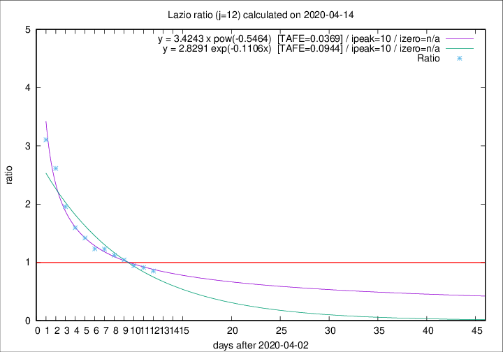
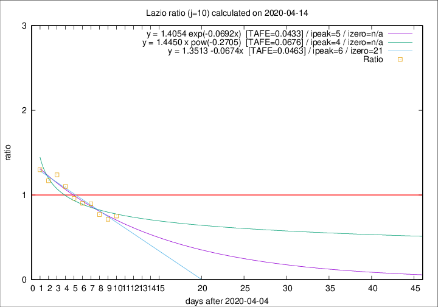

# Lazio

Data source: https://raw.githubusercontent.com/pcm-dpc/COVID-19/master/dati-json/dpc-covid19-ita-regioni.json

Estimates in this page were made on 16/4/2020 with data available until 14/04/2020.

## Summary 

### Peak estimate 
|j|linear [TAFE]|exponential [TAFE]|power law [TAFE]|details|
|---|----|-----------|---------|-------|
|7|10/4/2020 [TAFE=0.0828]|10/4/2020 [TAFE=0.0778]|10/4/2020 [TAFE=0.0554]|[analysis](COVID-19_lazio_j7_2020-04-14.md)|
|8|9/4/2020 [TAFE=0.0561]|9/4/2020 [TAFE=0.0564]|9/4/2020 [TAFE=0.0635]|[analysis](COVID-19_lazio_j8_2020-04-14.md)|
|9|10/4/2020 [TAFE=0.0670]|9/4/2020 [TAFE=0.0616]|9/4/2020 [TAFE=0.0476]|[analysis](COVID-19_lazio_j9_2020-04-14.md)|
|10|11/4/2020 [TAFE=0.0463]|10/4/2020 [TAFE=0.0433]|9/4/2020 [TAFE=0.0676]|[analysis](COVID-19_lazio_j10_2020-04-14.md)|
|11|12/4/2020 [TAFE=0.0622]|12/4/2020 [TAFE=0.0424]|11/4/2020 [TAFE=0.0552]|[analysis](COVID-19_lazio_j11_2020-04-14.md)|
|12|13/4/2020 [TAFE=0.1758]|13/4/2020 [TAFE=0.0944]|13/4/2020 [TAFE=0.0369]|[analysis](COVID-19_lazio_j12_2020-04-14.md)|
|13|13/4/2020 [TAFE=0.1674]|14/4/2020 [TAFE=0.0870]|16/4/2020 [TAFE=0.1121]|[analysis](COVID-19_lazio_j13_2020-04-14.md)|
|14|14/4/2020 [TAFE=0.1372]|15/4/2020 [TAFE=0.0729]|20/4/2020 [TAFE=0.1715]|[analysis](COVID-19_lazio_j14_2020-04-14.md)|

Best estimator is pow with j=12 (TAFE=0.0369)
Corresponding peak date estimate is 13/4/2020 (ipeak 10)

Peak date range estimate: 5/4/2020 - 22/4/2020

### End estimate 
|j|linear [TAFE/TFE]|exponential [TAFE/TFE]|power law [TAFE/TFE]|details|
|---|----|-----------|---------|-------|
|7|5/5/2020 [TAFE=0.0828]|-|-|[analysis](COVID-19_lazio_j7_2020-04-14.md)|
|8|9/5/2020 [TAFE=0.0561]|-|-|[analysis](COVID-19_lazio_j8_2020-04-14.md)|
|9|-|-|-|[analysis](COVID-19_lazio_j9_2020-04-14.md)|
|10|26/4/2020 [TAFE=0.0463]|-|-|[analysis](COVID-19_lazio_j10_2020-04-14.md)|
|11|-|-|-|[analysis](COVID-19_lazio_j11_2020-04-14.md)|
|12|-|-|-|[analysis](COVID-19_lazio_j12_2020-04-14.md)|
|13|-|-|-|[analysis](COVID-19_lazio_j13_2020-04-14.md)|
|14|-|-|-|[analysis](COVID-19_lazio_j14_2020-04-14.md)|

Best estimator is linear with j=10 (TAFE=0.0463)
Corresponding end date estimate is 26/4/2020 (izero 21)

End date range estimate: 5/4/2020 - 7/5/2020

Generated April 16th, 2020 at 20:09:19 UTC+0200 with https://github.com/robianc/COVID-19
