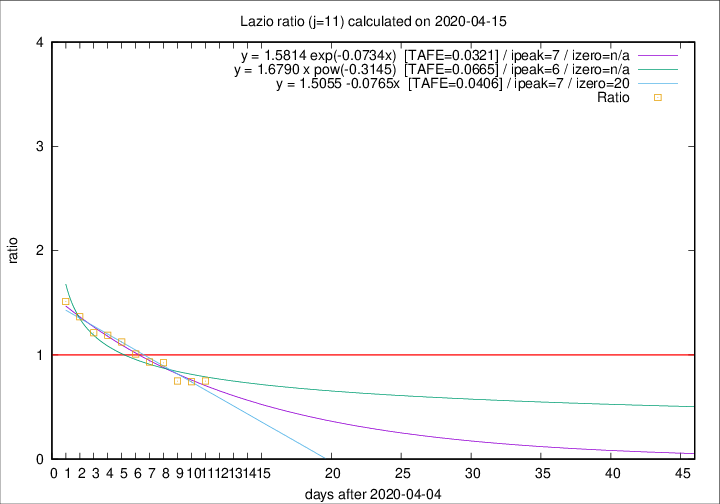

# Lazio

Data source: https://raw.githubusercontent.com/pcm-dpc/COVID-19/master/dati-json/dpc-covid19-ita-regioni.json

Delta days analysis (j): 11

Analyses for other values of j for 2020-04-15 are avalable [here](../2020-04-15/README.md)

Analyses for Lazio for previous dates are avalable [here](../README.md)

## Fitting 
|fit type|best fit equation|tafe|tfe|ipeak|izero|
|-------|-----|--------|------|---|---|
|linear|y = 1.5055 -0.0765x  [TAFE=0.0406]|0.0406|0.0010|7|20|
|exp|y = 1.5814 exp(-0.0734x)  [TAFE=0.0321]|0.0321|0.0009|7|n/a|
|pow|y = 1.6790 x pow(-0.3145)  [TAFE=0.0665]|0.0665|0.0028|6|n/a|

## Data
|Date|Daily deaths|Cumulated deaths|Deaths in the last 11 days|Deaths in the 11 days before|ratio|
|----|----------|-----------|-------|--------------------|-----|
|2020-04-15|11|311|99|132|0.7500|
|2020-04-14|16|300|101|136|0.7426|
|2020-04-13|5|284|99|132|0.7500|
|2020-04-12|6|279|110|119|0.9244|
|2020-04-11|10|273|111|119|0.9328|
|2020-04-10|10|263|113|112|1.0089|
|2020-04-09|9|253|117|104|1.1250|
|2020-04-08|6|244|120|101|1.1881|
|2020-04-07|9|238|120|99|1.2121|
|2020-04-06|10|229|123|90|1.3667|
|2020-04-05|7|219|124|82|1.5122|

[Download data as CSV](COVID-19_lazio_j11_2020-04-15.csv)

Generated April 16th, 2020 at 20:09:19 UTC+0200 with https://github.com/robianc/COVID-19
