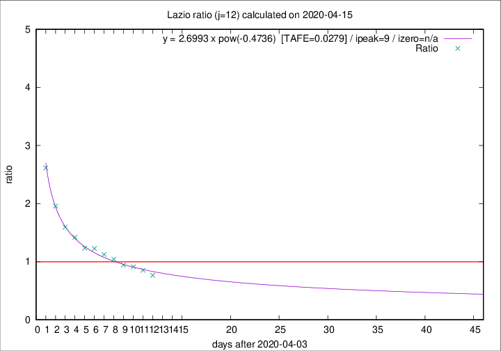

# Lazio

Data source: https://raw.githubusercontent.com/pcm-dpc/COVID-19/master/dati-json/dpc-covid19-ita-regioni.json

Estimates in this page were made on 19/4/2020 with data available until 15/04/2020.

## Summary 

### Peak estimate 
|j|linear [TAFE]|exponential [TAFE]|power law [TAFE]|details|
|---|----|-----------|---------|-------|
|7|11/4/2020 [TAFE=0.0860]|11/4/2020 [TAFE=0.0862]|11/4/2020 [TAFE=0.0840]|[analysis](COVID-19_lazio_j7_2020-04-15.md)|
|8|10/4/2020 [TAFE=0.0717]|10/4/2020 [TAFE=0.0709]|10/4/2020 [TAFE=0.0702]|[analysis](COVID-19_lazio_j8_2020-04-15.md)|
|9|9/4/2020 [TAFE=0.0664]|9/4/2020 [TAFE=0.0623]|9/4/2020 [TAFE=0.0502]|[analysis](COVID-19_lazio_j9_2020-04-15.md)|
|10|11/4/2020 [TAFE=0.0651]|11/4/2020 [TAFE=0.0582]|10/4/2020 [TAFE=0.0674]|[analysis](COVID-19_lazio_j10_2020-04-15.md)|
|11|12/4/2020 [TAFE=0.0406]|12/4/2020 [TAFE=0.0321]|11/4/2020 [TAFE=0.0665]|[analysis](COVID-19_lazio_j11_2020-04-15.md)|
|12|13/4/2020 [TAFE=0.1291]|13/4/2020 [TAFE=0.0712]|13/4/2020 [TAFE=0.0279]|[analysis](COVID-19_lazio_j12_2020-04-15.md)|
|13|14/4/2020 [TAFE=0.1942]|14/4/2020 [TAFE=0.1059]|15/4/2020 [TAFE=0.0856]|[analysis](COVID-19_lazio_j13_2020-04-15.md)|
|14|14/4/2020 [TAFE=0.1653]|15/4/2020 [TAFE=0.0869]|19/4/2020 [TAFE=0.1346]|[analysis](COVID-19_lazio_j14_2020-04-15.md)|

Best estimator is pow with j=12 (TAFE=0.0279)
Corresponding peak date estimate is 13/4/2020 (ipeak 9)

Peak date range estimate: 6/4/2020 - 21/4/2020

### End estimate 
|j|linear [TAFE/TFE]|exponential [TAFE/TFE]|power law [TAFE/TFE]|details|
|---|----|-----------|---------|-------|
|7|-|-|-|[analysis](COVID-19_lazio_j7_2020-04-15.md)|
|8|27/5/2020 [TAFE=0.0717]|-|-|[analysis](COVID-19_lazio_j8_2020-04-15.md)|
|9|7/5/2020 [TAFE=0.0664]|-|-|[analysis](COVID-19_lazio_j9_2020-04-15.md)|
|10|29/4/2020 [TAFE=0.0651]|-|-|[analysis](COVID-19_lazio_j10_2020-04-15.md)|
|11|25/4/2020 [TAFE=0.0406]|-|-|[analysis](COVID-19_lazio_j11_2020-04-15.md)|
|12|-|-|-|[analysis](COVID-19_lazio_j12_2020-04-15.md)|
|13|-|-|-|[analysis](COVID-19_lazio_j13_2020-04-15.md)|
|14|-|-|-|[analysis](COVID-19_lazio_j14_2020-04-15.md)|

Best estimator is linear with j=11 (TAFE=0.0406)
Corresponding end date estimate is 25/4/2020 (izero 20)

End date range estimate: 5/4/2020 - 24/5/2020

Generated April 19th, 2020 at 18:42:39 UTC+0200 with https://github.com/robianc/COVID-19
