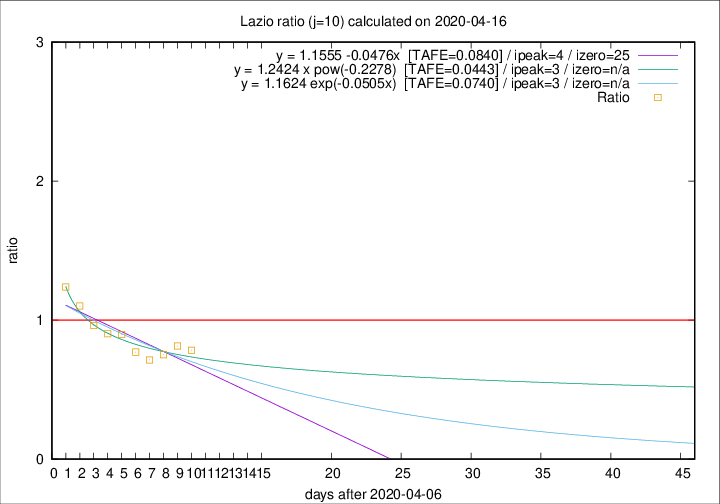

# Lazio

Data source: https://raw.githubusercontent.com/pcm-dpc/COVID-19/master/dati-json/dpc-covid19-ita-regioni.json

Delta days analysis (j): 10

Analyses for other values of j for 2020-04-16 are avalable [here](../2020-04-16/README.md)

Analyses for Lazio for previous dates are avalable [here](../README.md)

## Fitting 
|fit type|best fit equation|tafe|tfe|ipeak|izero|
|-------|-----|--------|------|---|---|
|linear|y = 1.1555 -0.0476x  [TAFE=0.0840]|0.0840|0.0072|4|25|
|exp|y = 1.1624 exp(-0.0505x)  [TAFE=0.0740]|0.0740|0.0034|3|n/a|
|pow|y = 1.2424 x pow(-0.2278)  [TAFE=0.0443]|0.0443|0.0016|3|n/a|

## Data
|Date|Daily deaths|Cumulated deaths|Deaths in the last 10 days|Deaths in the 10 days before|ratio|
|----|----------|-----------|-------|--------------------|-----|
|2020-04-16|5|316|87|111|0.7838|
|2020-04-15|11|311|92|113|0.8142|
|2020-04-14|16|300|88|117|0.7521|
|2020-04-13|5|284|85|119|0.7143|
|2020-04-12|6|279|94|122|0.7705|
|2020-04-11|10|273|104|116|0.8966|
|2020-04-10|10|263|101|112|0.9018|
|2020-04-09|9|253|103|107|0.9626|
|2020-04-08|6|244|108|98|1.1020|
|2020-04-07|9|238|114|92|1.2391|

[Download data as CSV](COVID-19_lazio_j10_2020-04-16.csv)

Generated April 19th, 2020 at 18:42:39 UTC+0200 with https://github.com/robianc/COVID-19
