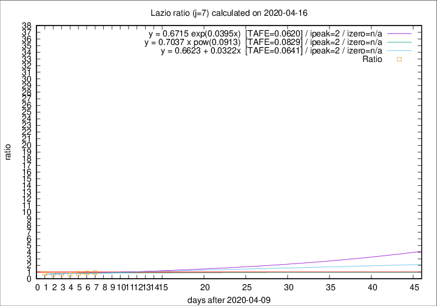

# Lazio

Data source: https://raw.githubusercontent.com/pcm-dpc/COVID-19/master/dati-json/dpc-covid19-ita-regioni.json

Delta days analysis (j): 7

Analyses for other values of j for 2020-04-16 are avalable [here](../2020-04-16/README.md)

Analyses for Lazio for previous dates are avalable [here](../README.md)

## Fitting 
|fit type|best fit equation|tafe|tfe|ipeak|izero|
|-------|-----|--------|------|---|---|
|linear|y = 0.6623 + 0.0322x  [TAFE=0.0641]|0.0641|0.0055|2|n/a|
|exp|y = 0.6715 exp(0.0395x)  [TAFE=0.0620]|0.0620|0.0027|2|n/a|
|pow|y = 0.7037 x pow(0.0913)  [TAFE=0.0829]|0.0829|0.0042|2|n/a|

## Data
|Date|Daily deaths|Cumulated deaths|Deaths in the last 7 days|Deaths in the 7 days before|ratio|
|----|----------|-----------|-------|--------------------|-----|
|2020-04-16|5|316|63|68|0.9265|
|2020-04-15|11|311|67|75|0.8933|
|2020-04-14|16|300|62|76|0.8158|
|2020-04-13|5|284|55|79|0.6962|
|2020-04-12|6|279|60|83|0.7229|
|2020-04-11|10|273|61|88|0.6932|
|2020-04-10|10|263|64|81|0.7901|

[Download data as CSV](COVID-19_lazio_j7_2020-04-16.csv)

Generated April 16th, 2020 at 20:09:19 UTC+0200 with https://github.com/robianc/COVID-19
