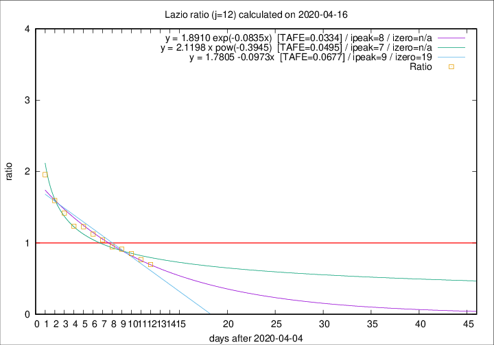
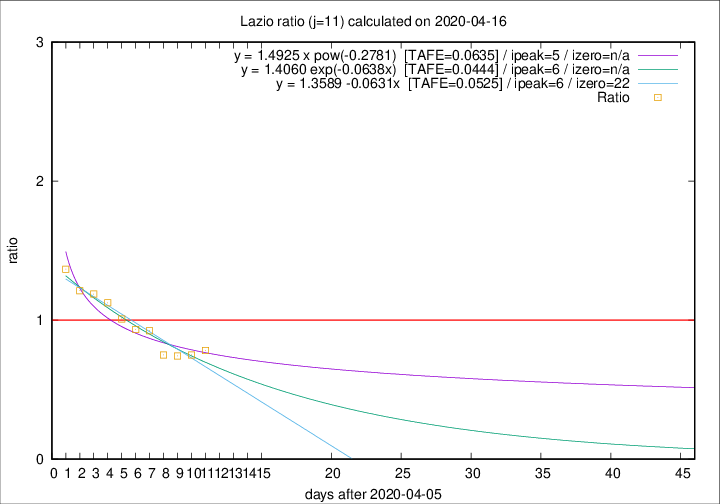

# Lazio

Data source: https://raw.githubusercontent.com/pcm-dpc/COVID-19/master/dati-json/dpc-covid19-ita-regioni.json

Estimates in this page were made on 16/4/2020 with data available until 16/04/2020.

## Summary 

### Peak estimate 
|j|linear [TAFE]|exponential [TAFE]|power law [TAFE]|details|
|---|----|-----------|---------|-------|
|7|12/4/2020 [TAFE=0.0641]|12/4/2020 [TAFE=0.0620]|12/4/2020 [TAFE=0.0829]|[analysis](COVID-19_lazio_j7_2020-04-16.md)|
|8|11/4/2020 [TAFE=0.0887]|11/4/2020 [TAFE=0.0880]|11/4/2020 [TAFE=0.0773]|[analysis](COVID-19_lazio_j8_2020-04-16.md)|
|9|10/4/2020 [TAFE=0.0539]|10/4/2020 [TAFE=0.0535]|10/4/2020 [TAFE=0.0464]|[analysis](COVID-19_lazio_j9_2020-04-16.md)|
|10|11/4/2020 [TAFE=0.0840]|10/4/2020 [TAFE=0.0740]|10/4/2020 [TAFE=0.0443]|[analysis](COVID-19_lazio_j10_2020-04-16.md)|
|11|12/4/2020 [TAFE=0.0525]|12/4/2020 [TAFE=0.0444]|11/4/2020 [TAFE=0.0635]|[analysis](COVID-19_lazio_j11_2020-04-16.md)|
|12|14/4/2020 [TAFE=0.0677]|13/4/2020 [TAFE=0.0334]|12/4/2020 [TAFE=0.0495]|[analysis](COVID-19_lazio_j12_2020-04-16.md)|
|13|14/4/2020 [TAFE=0.2024]|14/4/2020 [TAFE=0.1098]|14/4/2020 [TAFE=0.0466]|[analysis](COVID-19_lazio_j13_2020-04-16.md)|
|14|15/4/2020 [TAFE=0.1993]|15/4/2020 [TAFE=0.0981]|17/4/2020 [TAFE=0.0997]|[analysis](COVID-19_lazio_j14_2020-04-16.md)|

Best estimator is exp with j=12 (TAFE=0.0334)
Corresponding peak date estimate is 13/4/2020 (ipeak 8)

Peak date range estimate: 7/4/2020 - 19/4/2020

### End estimate 
|j|linear [TAFE/TFE]|exponential [TAFE/TFE]|power law [TAFE/TFE]|details|
|---|----|-----------|---------|-------|
|7|-|-|-|[analysis](COVID-19_lazio_j7_2020-04-16.md)|
|8|11/7/2020 [TAFE=0.0887]|-|-|[analysis](COVID-19_lazio_j8_2020-04-16.md)|
|9|24/5/2020 [TAFE=0.0539]|-|-|[analysis](COVID-19_lazio_j9_2020-04-16.md)|
|10|-|-|-|[analysis](COVID-19_lazio_j10_2020-04-16.md)|
|11|28/4/2020 [TAFE=0.0525]|-|-|[analysis](COVID-19_lazio_j11_2020-04-16.md)|
|12|-|-|-|[analysis](COVID-19_lazio_j12_2020-04-16.md)|
|13|-|-|-|[analysis](COVID-19_lazio_j13_2020-04-16.md)|
|14|-|-|-|[analysis](COVID-19_lazio_j14_2020-04-16.md)|

Best estimator is linear with j=11 (TAFE=0.0525)
Corresponding end date estimate is 28/4/2020 (izero 22)

End date range estimate: 6/4/2020 - 8/7/2020

Generated April 16th, 2020 at 20:09:19 UTC+0200 with https://github.com/robianc/COVID-19
