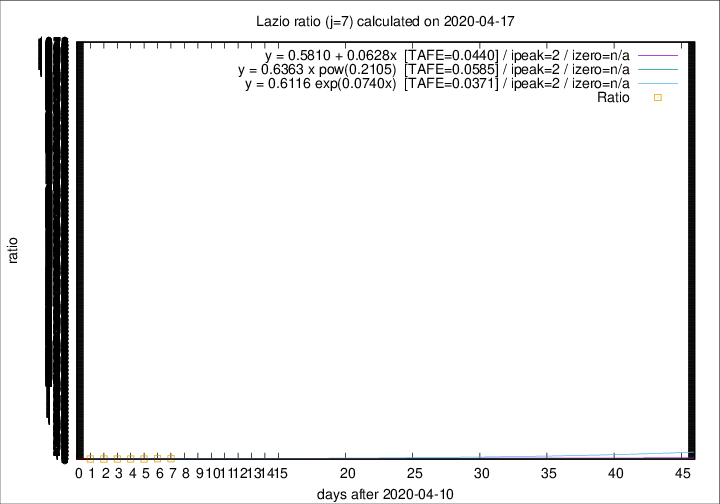
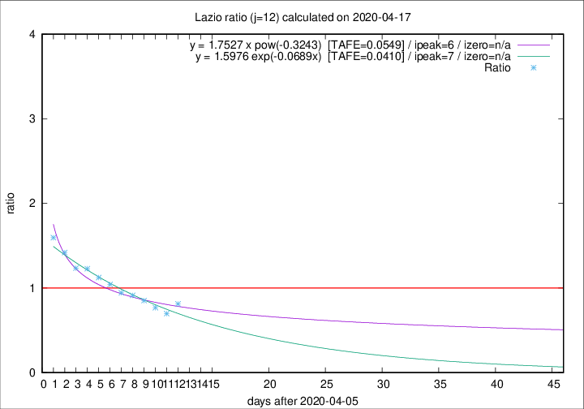

# Lazio

Data source: https://raw.githubusercontent.com/pcm-dpc/COVID-19/master/dati-json/dpc-covid19-ita-regioni.json

Estimates in this page were made on 19/4/2020 with data available until 17/04/2020.

## Summary 

### Peak estimate 
|j|linear [TAFE]|exponential [TAFE]|power law [TAFE]|details|
|---|----|-----------|---------|-------|
|7|13/4/2020 [TAFE=0.0440]|13/4/2020 [TAFE=0.0371]|13/4/2020 [TAFE=0.0585]|[analysis](COVID-19_lazio_j7_2020-04-17.md)|
|8|12/4/2020 [TAFE=0.0781]|12/4/2020 [TAFE=0.0773]|12/4/2020 [TAFE=0.0856]|[analysis](COVID-19_lazio_j8_2020-04-17.md)|
|9|11/4/2020 [TAFE=0.0698]|11/4/2020 [TAFE=0.0685]|11/4/2020 [TAFE=0.0614]|[analysis](COVID-19_lazio_j9_2020-04-17.md)|
|10|10/4/2020 [TAFE=0.0723]|10/4/2020 [TAFE=0.0697]|10/4/2020 [TAFE=0.0512]|[analysis](COVID-19_lazio_j10_2020-04-17.md)|
|11|12/4/2020 [TAFE=0.0718]|12/4/2020 [TAFE=0.0637]|11/4/2020 [TAFE=0.0672]|[analysis](COVID-19_lazio_j11_2020-04-17.md)|
|12|14/4/2020 [TAFE=0.0551]|13/4/2020 [TAFE=0.0410]|12/4/2020 [TAFE=0.0549]|[analysis](COVID-19_lazio_j12_2020-04-17.md)|
|13|15/4/2020 [TAFE=0.1459]|15/4/2020 [TAFE=0.0811]|14/4/2020 [TAFE=0.0371]|[analysis](COVID-19_lazio_j13_2020-04-17.md)|
|14|16/4/2020 [TAFE=0.2100]|16/4/2020 [TAFE=0.1101]|16/4/2020 [TAFE=0.0830]|[analysis](COVID-19_lazio_j14_2020-04-17.md)|

Best estimator is exp with j=7 (TAFE=0.0371)
Corresponding peak date estimate is 13/4/2020 (ipeak 2)

Peak date range estimate: 13/4/2020 - 23/4/2020

### End estimate 
|j|linear [TAFE/TFE]|exponential [TAFE/TFE]|power law [TAFE/TFE]|details|
|---|----|-----------|---------|-------|
|7|-|-|-|[analysis](COVID-19_lazio_j7_2020-04-17.md)|
|8|-|-|-|[analysis](COVID-19_lazio_j8_2020-04-17.md)|
|9|-|-|-|[analysis](COVID-19_lazio_j9_2020-04-17.md)|
|10|14/5/2020 [TAFE=0.0723]|-|-|[analysis](COVID-19_lazio_j10_2020-04-17.md)|
|11|3/5/2020 [TAFE=0.0718]|-|-|[analysis](COVID-19_lazio_j11_2020-04-17.md)|
|12|27/4/2020 [TAFE=0.0551]|-|-|[analysis](COVID-19_lazio_j12_2020-04-17.md)|
|13|-|-|-|[analysis](COVID-19_lazio_j13_2020-04-17.md)|
|14|-|-|-|[analysis](COVID-19_lazio_j14_2020-04-17.md)|

Best estimator is linear with j=12 (TAFE=0.0551)
Corresponding end date estimate is 27/4/2020 (izero 21)

End date range estimate: 6/4/2020 - 12/5/2020

Generated April 19th, 2020 at 18:42:39 UTC+0200 with https://github.com/robianc/COVID-19
