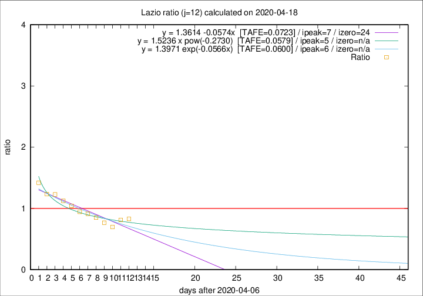

# Lazio

Data source: https://raw.githubusercontent.com/pcm-dpc/COVID-19/master/dati-json/dpc-covid19-ita-regioni.json

Delta days analysis (j): 12

Analyses for other values of j for 2020-04-18 are avalable [here](../2020-04-18/README.md)

Analyses for Lazio for previous dates are avalable [here](../README.md)

## Fitting 
|fit type|best fit equation|tafe|tfe|ipeak|izero|
|-------|-----|--------|------|---|---|
|linear|y = 1.3614 -0.0574x  [TAFE=0.0723]|0.0723|0.0051|7|24|
|exp|y = 1.3971 exp(-0.0566x)  [TAFE=0.0600]|0.0600|0.0030|6|n/a|
|pow|y = 1.5236 x pow(-0.2730)  [TAFE=0.0579]|0.0579|0.0025|5|n/a|

## Data
|Date|Daily deaths|Cumulated deaths|Deaths in the last 12 days|Deaths in the 12 days before|ratio|
|----|----------|-----------|-------|--------------------|-----|
|2020-04-18|8|340|111|134|0.8284|
|2020-04-17|16|332|113|139|0.8129|
|2020-04-16|5|316|104|149|0.6980|
|2020-04-15|11|311|112|146|0.7671|
|2020-04-14|16|300|115|135|0.8519|
|2020-04-13|5|284|115|126|0.9127|
|2020-04-12|6|279|117|124|0.9435|
|2020-04-11|10|273|123|118|1.0424|
|2020-04-10|10|263|127|113|1.1239|
|2020-04-09|9|253|129|105|1.2286|
|2020-04-08|6|244|126|102|1.2353|
|2020-04-07|9|238|132|93|1.4194|

[Download data as CSV](COVID-19_lazio_j12_2020-04-18.csv)

Generated April 19th, 2020 at 18:42:39 UTC+0200 with https://github.com/robianc/COVID-19
