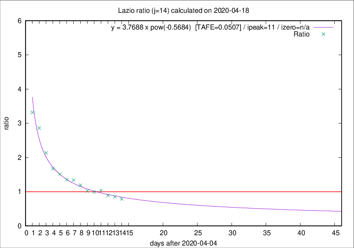

# Lazio

Data source: https://raw.githubusercontent.com/pcm-dpc/COVID-19/master/dati-json/dpc-covid19-ita-regioni.json

Delta days analysis (j): 14

Analyses for other values of j for 2020-04-18 are avalable [here](../2020-04-18/README.md)

Analyses for Lazio for previous dates are avalable [here](../README.md)

## Fitting 
|fit type|best fit equation|tafe|tfe|ipeak|izero|
|-------|-----|--------|------|---|---|
|pow|y = 3.7688 x pow(-0.5684)  [TAFE=0.0507]|0.0507|0.0020|11|n/a|

## Data
|Date|Daily deaths|Cumulated deaths|Deaths in the last 14 days|Deaths in the 14 days before|ratio|
|----|----------|-----------|-------|--------------------|-----|
|2020-04-18|8|340|128|162|0.7901|
|2020-04-17|16|332|133|156|0.8526|
|2020-04-16|5|316|131|147|0.8912|
|2020-04-15|11|311|142|137|1.0365|
|2020-04-14|16|300|138|139|0.9928|
|2020-04-13|5|284|134|131|1.0229|
|2020-04-12|6|279|143|120|1.1917|
|2020-04-11|10|273|149|111|1.3423|
|2020-04-10|10|263|145|107|1.3551|
|2020-04-09|9|253|147|97|1.5155|
|2020-04-08|6|244|149|89|1.6742|
|2020-04-07|9|238|158|74|2.1351|
|2020-04-06|10|229|166|58|2.8621|
|2020-04-05|7|219|166|50|3.3200|

[Download data as CSV](COVID-19_lazio_j14_2020-04-18.csv)

Generated April 19th, 2020 at 18:42:39 UTC+0200 with https://github.com/robianc/COVID-19
