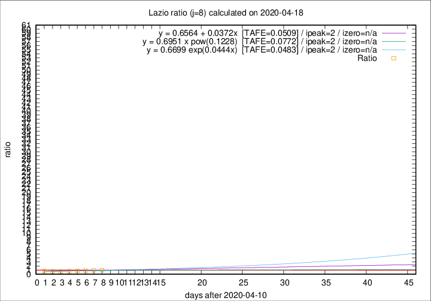

# Lazio

Data source: https://raw.githubusercontent.com/pcm-dpc/COVID-19/master/dati-json/dpc-covid19-ita-regioni.json

Delta days analysis (j): 8

Analyses for other values of j for 2020-04-18 are avalable [here](../2020-04-18/README.md)

Analyses for Lazio for previous dates are avalable [here](../README.md)

## Fitting 
|fit type|best fit equation|tafe|tfe|ipeak|izero|
|-------|-----|--------|------|---|---|
|linear|y = 0.6564 + 0.0372x  [TAFE=0.0509]|0.0509|0.0041|2|n/a|
|exp|y = 0.6699 exp(0.0444x)  [TAFE=0.0483]|0.0483|0.0022|2|n/a|
|pow|y = 0.6951 x pow(0.1228)  [TAFE=0.0772]|0.0772|0.0041|2|n/a|

## Data
|Date|Daily deaths|Cumulated deaths|Deaths in the last 8 days|Deaths in the 8 days before|ratio|
|----|----------|-----------|-------|--------------------|-----|
|2020-04-18|8|340|77|78|0.9872|
|2020-04-17|16|332|79|84|0.9405|
|2020-04-16|5|316|72|82|0.8780|
|2020-04-15|11|311|73|88|0.8295|
|2020-04-14|16|300|71|93|0.7634|
|2020-04-13|5|284|65|95|0.6842|
|2020-04-12|6|279|67|94|0.7128|
|2020-04-11|10|273|74|93|0.7957|

[Download data as CSV](COVID-19_lazio_j8_2020-04-18.csv)

Generated April 19th, 2020 at 18:42:39 UTC+0200 with https://github.com/robianc/COVID-19
