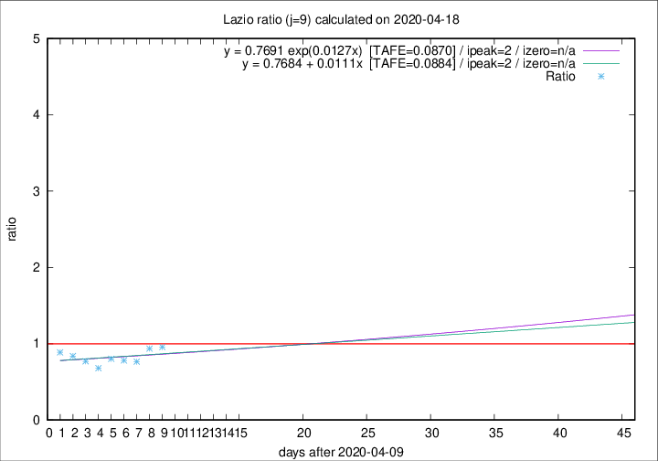

# Lazio

Data source: https://raw.githubusercontent.com/pcm-dpc/COVID-19/master/dati-json/dpc-covid19-ita-regioni.json

Delta days analysis (j): 9

Analyses for other values of j for 2020-04-18 are avalable [here](../2020-04-18/README.md)

Analyses for Lazio for previous dates are avalable [here](../README.md)

## Fitting 
|fit type|best fit equation|tafe|tfe|ipeak|izero|
|-------|-----|--------|------|---|---|
|linear|y = 0.7684 + 0.0111x  [TAFE=0.0884]|0.0884|0.0098|2|n/a|
|exp|y = 0.7691 exp(0.0127x)  [TAFE=0.0870]|0.0870|0.0050|2|n/a|

## Data
|Date|Daily deaths|Cumulated deaths|Deaths in the last 9 days|Deaths in the 9 days before|ratio|
|----|----------|-----------|-------|--------------------|-----|
|2020-04-18|8|340|87|91|0.9560|
|2020-04-17|16|332|88|94|0.9362|
|2020-04-16|5|316|78|102|0.7647|
|2020-04-15|11|311|82|105|0.7810|
|2020-04-14|16|300|81|101|0.8020|
|2020-04-13|5|284|72|106|0.6792|
|2020-04-12|6|279|80|104|0.7692|
|2020-04-11|10|273|88|105|0.8381|
|2020-04-10|10|263|94|106|0.8868|

[Download data as CSV](COVID-19_lazio_j9_2020-04-18.csv)

Generated April 19th, 2020 at 18:42:39 UTC+0200 with https://github.com/robianc/COVID-19
