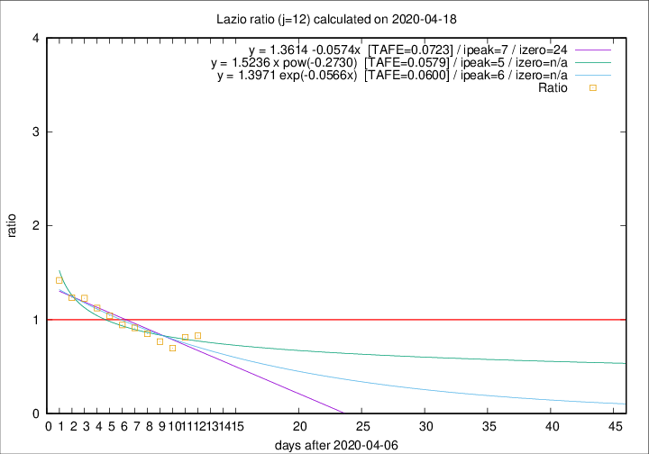

# Lazio

Data source: https://raw.githubusercontent.com/pcm-dpc/COVID-19/master/dati-json/dpc-covid19-ita-regioni.json

Estimates in this page were made on 19/4/2020 with data available until 18/04/2020.

## Summary 

### Peak estimate 
|j|linear [TAFE]|exponential [TAFE]|power law [TAFE]|details|
|---|----|-----------|---------|-------|
|7|14/4/2020 [TAFE=0.0330]|14/4/2020 [TAFE=0.0332]|14/4/2020 [TAFE=0.0613]|[analysis](COVID-19_lazio_j7_2020-04-18.md)|
|8|13/4/2020 [TAFE=0.0509]|13/4/2020 [TAFE=0.0483]|13/4/2020 [TAFE=0.0772]|[analysis](COVID-19_lazio_j8_2020-04-18.md)|
|9|12/4/2020 [TAFE=0.0884]|12/4/2020 [TAFE=0.0870]|12/4/2020 [TAFE=0.0886]|[analysis](COVID-19_lazio_j9_2020-04-18.md)|
|10|11/4/2020 [TAFE=0.0724]|11/4/2020 [TAFE=0.0721]|11/4/2020 [TAFE=0.0624]|[analysis](COVID-19_lazio_j10_2020-04-18.md)|
|11|12/4/2020 [TAFE=0.0858]|11/4/2020 [TAFE=0.0803]|11/4/2020 [TAFE=0.0624]|[analysis](COVID-19_lazio_j11_2020-04-18.md)|
|12|14/4/2020 [TAFE=0.0723]|13/4/2020 [TAFE=0.0600]|12/4/2020 [TAFE=0.0579]|[analysis](COVID-19_lazio_j12_2020-04-18.md)|
|13|15/4/2020 [TAFE=0.0809]|15/4/2020 [TAFE=0.0516]|14/4/2020 [TAFE=0.0472]|[analysis](COVID-19_lazio_j13_2020-04-18.md)|
|14|16/4/2020 [TAFE=0.2075]|16/4/2020 [TAFE=0.1089]|16/4/2020 [TAFE=0.0507]|[analysis](COVID-19_lazio_j14_2020-04-18.md)|

Best estimator is linear with j=7 (TAFE=0.0330)
Corresponding peak date estimate is 14/4/2020 (ipeak 2)

Peak date range estimate: 14/4/2020 - 23/4/2020

### End estimate 
|j|linear [TAFE/TFE]|exponential [TAFE/TFE]|power law [TAFE/TFE]|details|
|---|----|-----------|---------|-------|
|7|-|-|-|[analysis](COVID-19_lazio_j7_2020-04-18.md)|
|8|-|-|-|[analysis](COVID-19_lazio_j8_2020-04-18.md)|
|9|-|-|-|[analysis](COVID-19_lazio_j9_2020-04-18.md)|
|10|10/7/2020 [TAFE=0.0724]|-|-|[analysis](COVID-19_lazio_j10_2020-04-18.md)|
|11|-|-|-|[analysis](COVID-19_lazio_j11_2020-04-18.md)|
|12|1/5/2020 [TAFE=0.0723]|-|-|[analysis](COVID-19_lazio_j12_2020-04-18.md)|
|13|-|-|-|[analysis](COVID-19_lazio_j13_2020-04-18.md)|
|14|-|-|-|[analysis](COVID-19_lazio_j14_2020-04-18.md)|

Best estimator is linear with j=12 (TAFE=0.0723)
Corresponding end date estimate is 1/5/2020 (izero 24)

End date range estimate: 7/4/2020 - 8/7/2020

Generated April 19th, 2020 at 18:42:39 UTC+0200 with https://github.com/robianc/COVID-19
