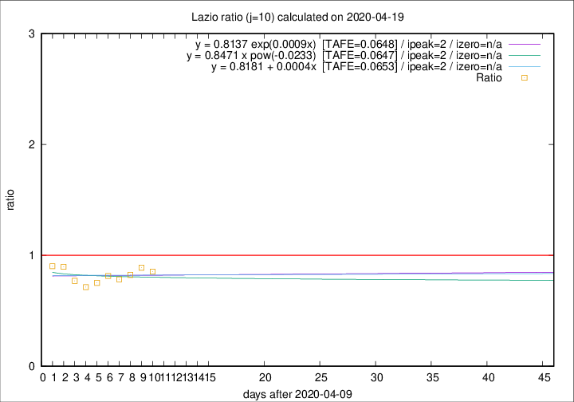

# Lazio

Data source: https://raw.githubusercontent.com/pcm-dpc/COVID-19/master/dati-json/dpc-covid19-ita-regioni.json

Delta days analysis (j): 10

Analyses for other values of j for 2020-04-19 are avalable [here](../2020-04-19/README.md)

Analyses for Lazio for previous dates are avalable [here](../README.md)

## Fitting 
|fit type|best fit equation|tafe|tfe|ipeak|izero|
|-------|-----|--------|------|---|---|
|linear|y = 0.8181 + 0.0004x  [TAFE=0.0653]|0.0653|0.0060|2|n/a|
|exp|y = 0.8137 exp(0.0009x)  [TAFE=0.0648]|0.0648|0.0029|2|n/a|
|pow|y = 0.8471 x pow(-0.0233)  [TAFE=0.0647]|0.0647|0.0028|2|n/a|

## Data
|Date|Daily deaths|Cumulated deaths|Deaths in the last 10 days|Deaths in the 10 days before|ratio|
|----|----------|-----------|-------|--------------------|-----|
|2020-04-19|1|341|88|103|0.8544|
|2020-04-18|8|340|96|108|0.8889|
|2020-04-17|16|332|94|114|0.8246|
|2020-04-16|5|316|87|111|0.7838|
|2020-04-15|11|311|92|113|0.8142|
|2020-04-14|16|300|88|117|0.7521|
|2020-04-13|5|284|85|119|0.7143|
|2020-04-12|6|279|94|122|0.7705|
|2020-04-11|10|273|104|116|0.8966|
|2020-04-10|10|263|101|112|0.9018|

[Download data as CSV](COVID-19_lazio_j10_2020-04-19.csv)

Generated April 19th, 2020 at 18:42:39 UTC+0200 with https://github.com/robianc/COVID-19
