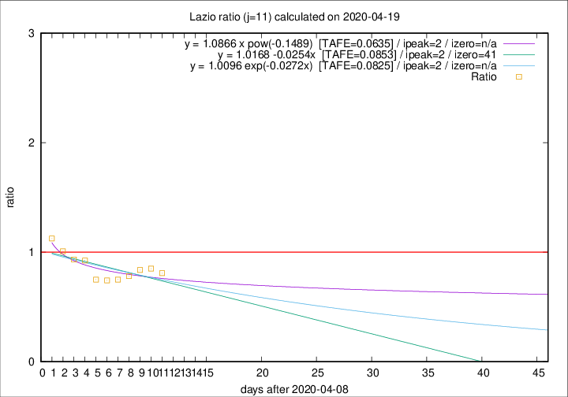

# Lazio

Data source: https://raw.githubusercontent.com/pcm-dpc/COVID-19/master/dati-json/dpc-covid19-ita-regioni.json

Delta days analysis (j): 11

Analyses for other values of j for 2020-04-19 are avalable [here](../2020-04-19/README.md)

Analyses for Lazio for previous dates are avalable [here](../README.md)

## Fitting 
|fit type|best fit equation|tafe|tfe|ipeak|izero|
|-------|-----|--------|------|---|---|
|linear|y = 1.0168 -0.0254x  [TAFE=0.0853]|0.0853|0.0088|2|41|
|exp|y = 1.0096 exp(-0.0272x)  [TAFE=0.0825]|0.0825|0.0049|2|n/a|
|pow|y = 1.0866 x pow(-0.1489)  [TAFE=0.0635]|0.0635|0.0027|2|n/a|

## Data
|Date|Daily deaths|Cumulated deaths|Deaths in the last 11 days|Deaths in the 11 days before|ratio|
|----|----------|-----------|-------|--------------------|-----|
|2020-04-19|1|341|97|120|0.8083|
|2020-04-18|8|340|102|120|0.8500|
|2020-04-17|16|332|103|123|0.8374|
|2020-04-16|5|316|97|124|0.7823|
|2020-04-15|11|311|99|132|0.7500|
|2020-04-14|16|300|101|136|0.7426|
|2020-04-13|5|284|99|132|0.7500|
|2020-04-12|6|279|110|119|0.9244|
|2020-04-11|10|273|111|119|0.9328|
|2020-04-10|10|263|113|112|1.0089|
|2020-04-09|9|253|117|104|1.1250|

[Download data as CSV](COVID-19_lazio_j11_2020-04-19.csv)

Generated April 19th, 2020 at 18:42:39 UTC+0200 with https://github.com/robianc/COVID-19
