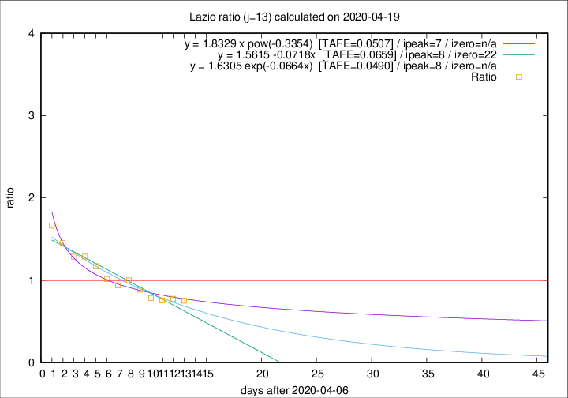

# Lazio

Data source: https://raw.githubusercontent.com/pcm-dpc/COVID-19/master/dati-json/dpc-covid19-ita-regioni.json

Delta days analysis (j): 13

Analyses for other values of j for 2020-04-19 are avalable [here](../2020-04-19/README.md)

Analyses for Lazio for previous dates are avalable [here](../README.md)

## Fitting 
|fit type|best fit equation|tafe|tfe|ipeak|izero|
|-------|-----|--------|------|---|---|
|linear|y = 1.5615 -0.0718x  [TAFE=0.0659]|0.0659|0.0024|8|22|
|exp|y = 1.6305 exp(-0.0664x)  [TAFE=0.0490]|0.0490|0.0016|8|n/a|
|pow|y = 1.8329 x pow(-0.3354)  [TAFE=0.0507]|0.0507|0.0020|7|n/a|

## Data
|Date|Daily deaths|Cumulated deaths|Deaths in the last 13 days|Deaths in the 13 days before|ratio|
|----|----------|-----------|-------|--------------------|-----|
|2020-04-19|1|341|112|149|0.7517|
|2020-04-18|8|340|121|156|0.7756|
|2020-04-17|16|332|120|159|0.7547|
|2020-04-16|5|316|117|149|0.7852|
|2020-04-15|11|311|126|142|0.8873|
|2020-04-14|16|300|131|131|1.0000|
|2020-04-13|5|284|122|130|0.9385|
|2020-04-12|6|279|129|127|1.0157|
|2020-04-11|10|273|137|117|1.1709|
|2020-04-10|10|263|139|108|1.2870|
|2020-04-09|9|253|135|105|1.2857|
|2020-04-08|6|244|138|95|1.4526|
|2020-04-07|9|238|143|86|1.6628|

[Download data as CSV](COVID-19_lazio_j13_2020-04-19.csv)

Generated April 19th, 2020 at 18:42:39 UTC+0200 with https://github.com/robianc/COVID-19
