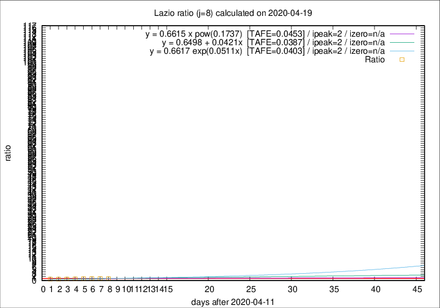

# Lazio

Data source: https://raw.githubusercontent.com/pcm-dpc/COVID-19/master/dati-json/dpc-covid19-ita-regioni.json

Delta days analysis (j): 8

Analyses for other values of j for 2020-04-19 are avalable [here](../2020-04-19/README.md)

Analyses for Lazio for previous dates are avalable [here](../README.md)

## Fitting 
|fit type|best fit equation|tafe|tfe|ipeak|izero|
|-------|-----|--------|------|---|---|
|linear|y = 0.6498 + 0.0421x  [TAFE=0.0387]|0.0387|0.0020|2|n/a|
|exp|y = 0.6617 exp(0.0511x)  [TAFE=0.0403]|0.0403|0.0010|2|n/a|
|pow|y = 0.6615 x pow(0.1737)  [TAFE=0.0453]|0.0453|0.0014|2|n/a|

## Data
|Date|Daily deaths|Cumulated deaths|Deaths in the last 8 days|Deaths in the 8 days before|ratio|
|----|----------|-----------|-------|--------------------|-----|
|2020-04-19|1|341|68|74|0.9189|
|2020-04-18|8|340|77|78|0.9872|
|2020-04-17|16|332|79|84|0.9405|
|2020-04-16|5|316|72|82|0.8780|
|2020-04-15|11|311|73|88|0.8295|
|2020-04-14|16|300|71|93|0.7634|
|2020-04-13|5|284|65|95|0.6842|
|2020-04-12|6|279|67|94|0.7128|

[Download data as CSV](COVID-19_lazio_j8_2020-04-19.csv)

Generated April 19th, 2020 at 18:42:39 UTC+0200 with https://github.com/robianc/COVID-19
