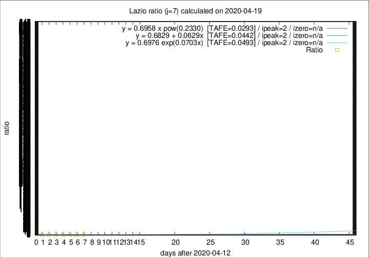

# Lazio

Data source: https://raw.githubusercontent.com/pcm-dpc/COVID-19/master/dati-json/dpc-covid19-ita-regioni.json

Estimates in this page were made on 19/4/2020 with data available until 19/04/2020.

## Summary 

### Peak estimate 
|j|linear [TAFE]|exponential [TAFE]|power law [TAFE]|details|
|---|----|-----------|---------|-------|
|7|15/4/2020 [TAFE=0.0442]|15/4/2020 [TAFE=0.0493]|15/4/2020 [TAFE=0.0293]|[analysis](COVID-19_lazio_j7_2020-04-19.md)|
|8|14/4/2020 [TAFE=0.0387]|14/4/2020 [TAFE=0.0403]|14/4/2020 [TAFE=0.0453]|[analysis](COVID-19_lazio_j8_2020-04-19.md)|
|9|13/4/2020 [TAFE=0.0722]|13/4/2020 [TAFE=0.0718]|13/4/2020 [TAFE=0.0767]|[analysis](COVID-19_lazio_j9_2020-04-19.md)|
|10|12/4/2020 [TAFE=0.0653]|12/4/2020 [TAFE=0.0648]|12/4/2020 [TAFE=0.0647]|[analysis](COVID-19_lazio_j10_2020-04-19.md)|
|11|11/4/2020 [TAFE=0.0853]|11/4/2020 [TAFE=0.0825]|11/4/2020 [TAFE=0.0635]|[analysis](COVID-19_lazio_j11_2020-04-19.md)|
|12|14/4/2020 [TAFE=0.0769]|13/4/2020 [TAFE=0.0670]|12/4/2020 [TAFE=0.0579]|[analysis](COVID-19_lazio_j12_2020-04-19.md)|
|13|15/4/2020 [TAFE=0.0659]|15/4/2020 [TAFE=0.0490]|14/4/2020 [TAFE=0.0507]|[analysis](COVID-19_lazio_j13_2020-04-19.md)|
|14|17/4/2020 [TAFE=0.1522]|16/4/2020 [TAFE=0.0840]|15/4/2020 [TAFE=0.0388]|[analysis](COVID-19_lazio_j14_2020-04-19.md)|

Best estimator is pow with j=7 (TAFE=0.0293)
Corresponding peak date estimate is 15/4/2020 (ipeak 2)

Peak date range estimate: 15/4/2020 - 24/4/2020

### End estimate 
|j|linear [TAFE/TFE]|exponential [TAFE/TFE]|power law [TAFE/TFE]|details|
|---|----|-----------|---------|-------|
|7|-|-|-|[analysis](COVID-19_lazio_j7_2020-04-19.md)|
|8|-|-|-|[analysis](COVID-19_lazio_j8_2020-04-19.md)|
|9|-|-|-|[analysis](COVID-19_lazio_j9_2020-04-19.md)|
|10|-|-|-|[analysis](COVID-19_lazio_j10_2020-04-19.md)|
|11|20/5/2020 [TAFE=0.0853]|-|-|[analysis](COVID-19_lazio_j11_2020-04-19.md)|
|12|5/5/2020 [TAFE=0.0769]|-|-|[analysis](COVID-19_lazio_j12_2020-04-19.md)|
|13|29/4/2020 [TAFE=0.0659]|-|-|[analysis](COVID-19_lazio_j13_2020-04-19.md)|
|14|-|-|-|[analysis](COVID-19_lazio_j14_2020-04-19.md)|

Best estimator is linear with j=13 (TAFE=0.0659)
Corresponding end date estimate is 29/4/2020 (izero 22)

End date range estimate: 7/4/2020 - 18/5/2020

Generated April 19th, 2020 at 18:42:39 UTC+0200 with https://github.com/robianc/COVID-19
