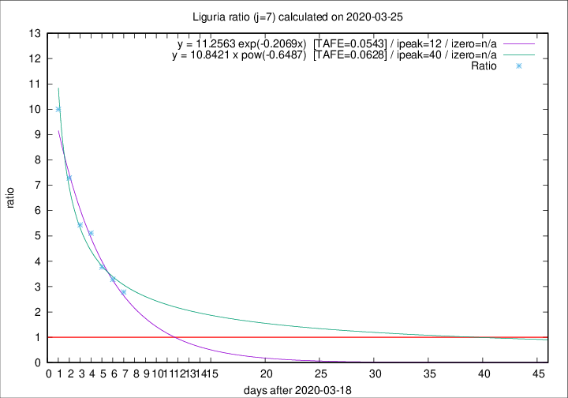

# Liguria

Data source: https://raw.githubusercontent.com/pcm-dpc/COVID-19/master/dati-json/dpc-covid19-ita-regioni.json

Delta days analysis (j): 7

Analyses for other values of j for 2020-03-25 are avalable [here](../README.md)

Analyses for Liguria for previous dates are avalable [here](../../README.md)

## Fitting 
|fit type|best fit equation|tafe|tfe|ipeak|izero|
|-------|-----|--------|------|---|---|
|exp|y = 11.2563 exp(-0.2069x)  [TAFE=0.0543]|0.0543|0.0019|12|n/a|
|pow|y = 10.8421 x pow(-0.6487)  [TAFE=0.0628]|0.0628|0.0030|40|n/a|

## Data
|Date|Daily deaths|Cumulated deaths|Deaths in the last 7 days|Deaths in the 7 days before|ratio|
|----|----------|-----------|-------|--------------------|-----|
|2020-03-25|23|254|181|65|2.7846|
|2020-03-24|19|231|171|52|3.2885|
|2020-03-23|41|212|162|43|3.7674|
|2020-03-22|19|171|138|27|5.1111|
|2020-03-21|33|152|125|23|5.4348|
|2020-03-20|28|119|102|14|7.2857|
|2020-03-19|18|91|80|8|10.0000|

[Download data as CSV](COVID-19_liguria_j7_2020-03-25.csv)

Generated April 10th, 2020 at 17:26:10 UTC+0200 with https://github.com/robianc/COVID-19
