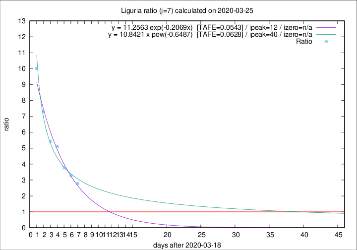

# Liguria

Data source: https://raw.githubusercontent.com/pcm-dpc/COVID-19/master/dati-json/dpc-covid19-ita-regioni.json

Estimates in this page were made on 9/4/2020 with data available until 25/03/2020.

## Summary 

### Peak estimate 
|j|linear [TAFE]|exponential [TAFE]|power law [TAFE]|details|
|---|----|-----------|---------|-------|
|7|27/3/2020 [TAFE=0.1240]|31/3/2020 [TAFE=0.0543]|28/4/2020 [TAFE=0.0628]|[analysis](COVID-19_liguria_j7_2020-03-25.md)|
|8|29/3/2020 [TAFE=0.1638]|5/4/2020 [TAFE=0.1815]|-|[analysis](COVID-19_liguria_j8_2020-03-25.md)|
|9|5/4/2020 [TAFE=0.2271]|19/4/2020 [TAFE=0.2165]|-|[analysis](COVID-19_liguria_j9_2020-03-25.md)|
|10|10/4/2020 [TAFE=0.1821]|4/5/2020 [TAFE=0.1808]|-|[analysis](COVID-19_liguria_j10_2020-03-25.md)|
|11|-|-|-||
|12|-|-|-||
|13|-|-|-||
|14|-|-|-||

Best estimator is exp with j=7 (TAFE=0.0543)
Corresponding peak date estimate is 31/3/2020 (ipeak 12)

Peak date range estimate: 19/3/2020 - 7/5/2020

### End estimate 
|j|linear [TAFE/TFE]|exponential [TAFE/TFE]|power law [TAFE/TFE]|details|
|---|----|-----------|---------|-------|
|7|28/3/2020 [TAFE=0.1240]|-|-|[analysis](COVID-19_liguria_j7_2020-03-25.md)|
|8|-|-|-|[analysis](COVID-19_liguria_j8_2020-03-25.md)|
|9|-|-|-|[analysis](COVID-19_liguria_j9_2020-03-25.md)|
|10|-|-|-|[analysis](COVID-19_liguria_j10_2020-03-25.md)|
|11|-|-|-||
|12|-|-|-||
|13|-|-|-||
|14|-|-|-||

Best estimator is linear with j=7 (TAFE=0.1240)
Corresponding end date estimate is 28/3/2020 (izero 9)

End date range estimate: 19/3/2020 - 15/4/2020

Generated April 9th, 2020 at 16:40:48 UTC+0200 with https://github.com/robianc/COVID-19
