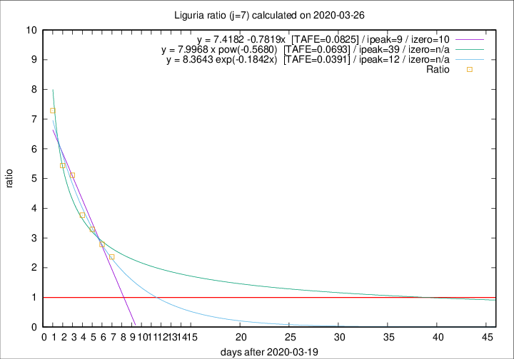

# Liguria

Data source: https://raw.githubusercontent.com/pcm-dpc/COVID-19/master/dati-json/dpc-covid19-ita-regioni.json

Delta days analysis (j): 7

Analyses for other values of j for 2020-03-26 are avalable [here](../2020-03-26/README.md)

Analyses for Liguria for previous dates are avalable [here](../README.md)

## Fitting 
|fit type|best fit equation|tafe|tfe|ipeak|izero|
|-------|-----|--------|------|---|---|
|linear|y = 7.4182 -0.7819x  [TAFE=0.0825]|0.0825|-0.0016|9|10|
|exp|y = 8.3643 exp(-0.1842x)  [TAFE=0.0391]|0.0391|0.0009|12|n/a|
|pow|y = 7.9968 x pow(-0.5680)  [TAFE=0.0693]|0.0693|0.0040|39|n/a|

## Data
|Date|Daily deaths|Cumulated deaths|Deaths in the last 7 days|Deaths in the 7 days before|ratio|
|----|----------|-----------|-------|--------------------|-----|
|2020-03-26|26|280|189|80|2.3625|
|2020-03-25|23|254|181|65|2.7846|
|2020-03-24|19|231|171|52|3.2885|
|2020-03-23|41|212|162|43|3.7674|
|2020-03-22|19|171|138|27|5.1111|
|2020-03-21|33|152|125|23|5.4348|
|2020-03-20|28|119|102|14|7.2857|

[Download data as CSV](COVID-19_liguria_j7_2020-03-26.csv)

Generated April 16th, 2020 at 20:09:19 UTC+0200 with https://github.com/robianc/COVID-19
