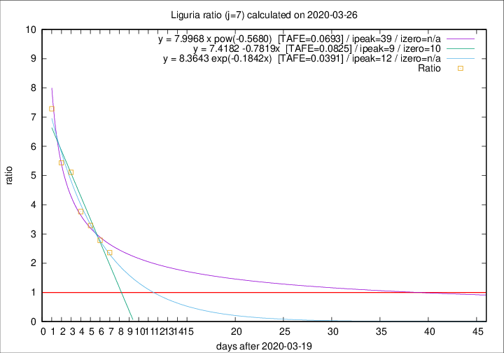

# Liguria

Data source: https://raw.githubusercontent.com/pcm-dpc/COVID-19/master/dati-json/dpc-covid19-ita-regioni.json

Estimates in this page were made on 19/4/2020 with data available until 26/03/2020.

## Summary 

### Peak estimate 
|j|linear [TAFE]|exponential [TAFE]|power law [TAFE]|details|
|---|----|-----------|---------|-------|
|7|29/3/2020 [TAFE=0.0825]|1/4/2020 [TAFE=0.0391]|28/4/2020 [TAFE=0.0693]|[analysis](COVID-19_liguria_j7_2020-03-26.md)|
|8|28/3/2020 [TAFE=0.1174]|2/4/2020 [TAFE=0.0813]|15/5/2020 [TAFE=0.1520]|[analysis](COVID-19_liguria_j8_2020-03-26.md)|
|9|31/3/2020 [TAFE=0.1901]|8/4/2020 [TAFE=0.2124]|-|[analysis](COVID-19_liguria_j9_2020-03-26.md)|
|10|5/4/2020 [TAFE=0.2314]|18/4/2020 [TAFE=0.2283]|-|[analysis](COVID-19_liguria_j10_2020-03-26.md)|
|11|-|-|-||
|12|-|-|-||
|13|-|-|-||
|14|-|-|-||

Best estimator is exp with j=7 (TAFE=0.0391)
Corresponding peak date estimate is 1/4/2020 (ipeak 12)

Peak date range estimate: 20/3/2020 - 16/5/2020

### End estimate 
|j|linear [TAFE/TFE]|exponential [TAFE/TFE]|power law [TAFE/TFE]|details|
|---|----|-----------|---------|-------|
|7|30/3/2020 [TAFE=0.0825]|-|-|[analysis](COVID-19_liguria_j7_2020-03-26.md)|
|8|-|-|-|[analysis](COVID-19_liguria_j8_2020-03-26.md)|
|9|-|-|-|[analysis](COVID-19_liguria_j9_2020-03-26.md)|
|10|-|-|-|[analysis](COVID-19_liguria_j10_2020-03-26.md)|
|11|-|-|-||
|12|-|-|-||
|13|-|-|-||
|14|-|-|-||

Best estimator is linear with j=7 (TAFE=0.0825)
Corresponding end date estimate is 30/3/2020 (izero 10)

End date range estimate: 20/3/2020 - 9/4/2020

Generated April 19th, 2020 at 18:42:39 UTC+0200 with https://github.com/robianc/COVID-19
