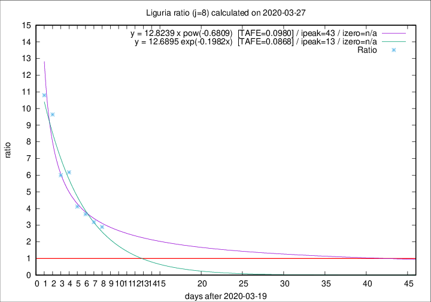

# Liguria

Data source: https://raw.githubusercontent.com/pcm-dpc/COVID-19/master/dati-json/dpc-covid19-ita-regioni.json

Delta days analysis (j): 8

Analyses for other values of j for 2020-03-27 are avalable [here](../2020-03-27/README.md)

Analyses for Liguria for previous dates are avalable [here](../README.md)

## Fitting 
|fit type|best fit equation|tafe|tfe|ipeak|izero|
|-------|-----|--------|------|---|---|
|exp|y = 12.6895 exp(-0.1982x)  [TAFE=0.0868]|0.0868|0.0051|13|n/a|
|pow|y = 12.8239 x pow(-0.6809)  [TAFE=0.0980]|0.0980|0.0075|43|n/a|

## Data
|Date|Daily deaths|Cumulated deaths|Deaths in the last 8 days|Deaths in the 8 days before|ratio|
|----|----------|-----------|-------|--------------------|-----|
|2020-03-27|51|331|240|83|2.8916|
|2020-03-26|26|280|207|65|3.1846|
|2020-03-25|23|254|194|53|3.6604|
|2020-03-24|19|231|181|44|4.1136|
|2020-03-23|41|212|179|29|6.1724|
|2020-03-22|19|171|144|24|6.0000|
|2020-03-21|33|152|135|14|9.6429|
|2020-03-20|28|119|108|10|10.8000|

[Download data as CSV](COVID-19_liguria_j8_2020-03-27.csv)

Generated April 19th, 2020 at 18:42:39 UTC+0200 with https://github.com/robianc/COVID-19
