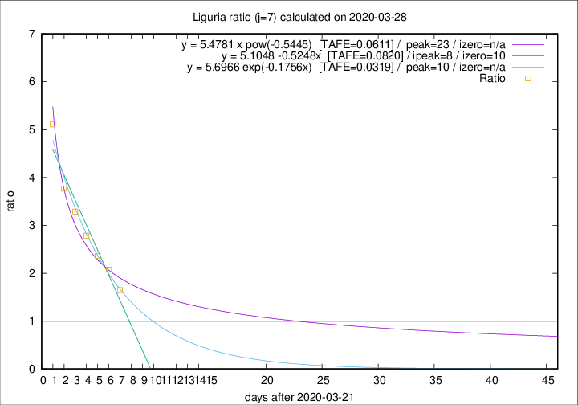

# Liguria

Data source: https://raw.githubusercontent.com/pcm-dpc/COVID-19/master/dati-json/dpc-covid19-ita-regioni.json

Estimates in this page were made on 14/4/2020 with data available until 28/03/2020.

## Summary 

### Peak estimate 
|j|linear [TAFE]|exponential [TAFE]|power law [TAFE]|details|
|---|----|-----------|---------|-------|
|7|30/3/2020 [TAFE=0.0820]|1/4/2020 [TAFE=0.0319]|14/4/2020 [TAFE=0.0611]|[analysis](COVID-19_liguria_j7_2020-03-28.md)|
|8|30/3/2020 [TAFE=0.1635]|3/4/2020 [TAFE=0.0832]|24/4/2020 [TAFE=0.0740]|[analysis](COVID-19_liguria_j8_2020-03-28.md)|
|9|30/3/2020 [TAFE=0.1944]|4/4/2020 [TAFE=0.0788]|13/5/2020 [TAFE=0.1500]|[analysis](COVID-19_liguria_j9_2020-03-28.md)|
|10|1/4/2020 [TAFE=0.1739]|8/4/2020 [TAFE=0.1735]|-|[analysis](COVID-19_liguria_j10_2020-03-28.md)|
|11|3/4/2020 [TAFE=0.2028]|14/4/2020 [TAFE=0.2114]|-|[analysis](COVID-19_liguria_j11_2020-03-28.md)|
|12|-|-|-||
|13|-|-|-||
|14|-|-|-||

Best estimator is exp with j=7 (TAFE=0.0319)
Corresponding peak date estimate is 1/4/2020 (ipeak 10)

Peak date range estimate: 22/3/2020 - 15/5/2020

### End estimate 
|j|linear [TAFE/TFE]|exponential [TAFE/TFE]|power law [TAFE/TFE]|details|
|---|----|-----------|---------|-------|
|7|1/4/2020 [TAFE=0.0820]|-|-|[analysis](COVID-19_liguria_j7_2020-03-28.md)|
|8|-|-|-|[analysis](COVID-19_liguria_j8_2020-03-28.md)|
|9|-|-|-|[analysis](COVID-19_liguria_j9_2020-03-28.md)|
|10|-|-|-|[analysis](COVID-19_liguria_j10_2020-03-28.md)|
|11|-|-|-|[analysis](COVID-19_liguria_j11_2020-03-28.md)|
|12|-|-|-||
|13|-|-|-||
|14|-|-|-||

Best estimator is linear with j=7 (TAFE=0.0820)
Corresponding end date estimate is 1/4/2020 (izero 10)

End date range estimate: 22/3/2020 - 8/4/2020

Generated April 14th, 2020 at 19:16:04 UTC+0200 with https://github.com/robianc/COVID-19
