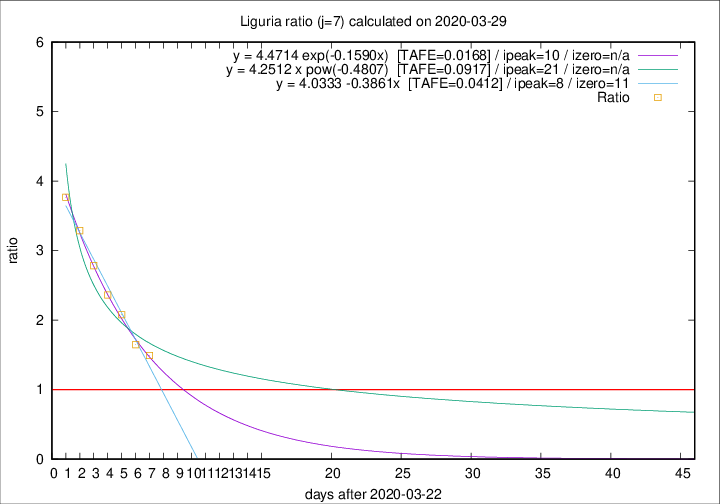

# Liguria

Data source: https://raw.githubusercontent.com/pcm-dpc/COVID-19/master/dati-json/dpc-covid19-ita-regioni.json

Delta days analysis (j): 7

Analyses for other values of j for 2020-03-29 are avalable [here](../2020-03-29/README.md)

Analyses for Liguria for previous dates are avalable [here](../README.md)

## Fitting 
|fit type|best fit equation|tafe|tfe|ipeak|izero|
|-------|-----|--------|------|---|---|
|linear|y = 4.0333 -0.3861x  [TAFE=0.0412]|0.0412|-0.0014|8|11|
|exp|y = 4.4714 exp(-0.1590x)  [TAFE=0.0168]|0.0168|0.0002|10|n/a|
|pow|y = 4.2512 x pow(-0.4807)  [TAFE=0.0917]|0.0917|0.0044|21|n/a|

## Data
|Date|Daily deaths|Cumulated deaths|Deaths in the last 7 days|Deaths in the 7 days before|ratio|
|----|----------|-----------|-------|--------------------|-----|
|2020-03-29|19|377|206|138|1.4928|
|2020-03-28|27|358|206|125|1.6480|
|2020-03-27|51|331|212|102|2.0784|
|2020-03-26|26|280|189|80|2.3625|
|2020-03-25|23|254|181|65|2.7846|
|2020-03-24|19|231|171|52|3.2885|
|2020-03-23|41|212|162|43|3.7674|

[Download data as CSV](COVID-19_liguria_j7_2020-03-29.csv)

Generated April 16th, 2020 at 20:09:19 UTC+0200 with https://github.com/robianc/COVID-19
