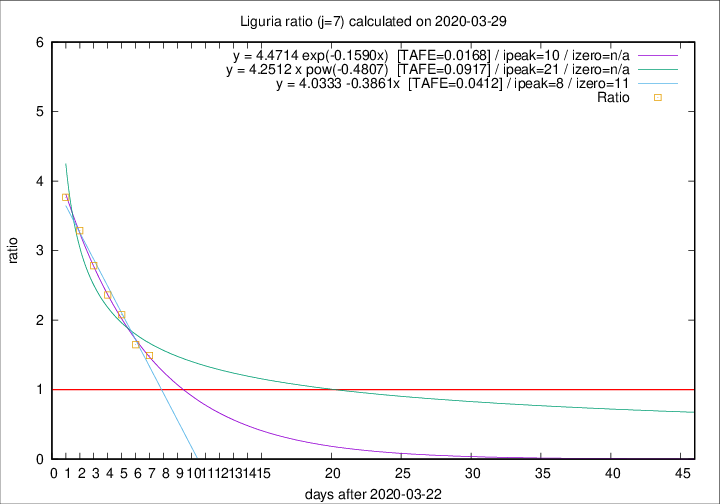

# Liguria

Data source: https://raw.githubusercontent.com/pcm-dpc/COVID-19/master/dati-json/dpc-covid19-ita-regioni.json

Estimates in this page were made on 12/4/2020 with data available until 29/03/2020.

## Summary 

### Peak estimate 
|j|linear [TAFE]|exponential [TAFE]|power law [TAFE]|details|
|---|----|-----------|---------|-------|
|7|31/3/2020 [TAFE=0.0412]|2/4/2020 [TAFE=0.0168]|13/4/2020 [TAFE=0.0917]|[analysis](COVID-19_liguria_j7_2020-03-29.md)|
|8|31/3/2020 [TAFE=0.0820]|3/4/2020 [TAFE=0.0681]|21/4/2020 [TAFE=0.1461]|[analysis](COVID-19_liguria_j8_2020-03-29.md)|
|9|31/3/2020 [TAFE=0.2180]|4/4/2020 [TAFE=0.0781]|27/4/2020 [TAFE=0.0939]|[analysis](COVID-19_liguria_j9_2020-03-29.md)|
|10|31/3/2020 [TAFE=0.1926]|6/4/2020 [TAFE=0.1169]|11/6/2020 [TAFE=0.2348]|[analysis](COVID-19_liguria_j10_2020-03-29.md)|
|11|2/4/2020 [TAFE=0.1785]|10/4/2020 [TAFE=0.1887]|-|[analysis](COVID-19_liguria_j11_2020-03-29.md)|
|12|-|-|-||
|13|-|-|-||
|14|-|-|-||

Best estimator is exp with j=7 (TAFE=0.0168)
Corresponding peak date estimate is 2/4/2020 (ipeak 10)

Peak date range estimate: 23/3/2020 - 14/6/2020

### End estimate 
|j|linear [TAFE/TFE]|exponential [TAFE/TFE]|power law [TAFE/TFE]|details|
|---|----|-----------|---------|-------|
|7|3/4/2020 [TAFE=0.0412]|-|-|[analysis](COVID-19_liguria_j7_2020-03-29.md)|
|8|-|-|-|[analysis](COVID-19_liguria_j8_2020-03-29.md)|
|9|-|-|-|[analysis](COVID-19_liguria_j9_2020-03-29.md)|
|10|-|-|-|[analysis](COVID-19_liguria_j10_2020-03-29.md)|
|11|-|-|-|[analysis](COVID-19_liguria_j11_2020-03-29.md)|
|12|-|-|-||
|13|-|-|-||
|14|-|-|-||

Best estimator is linear with j=7 (TAFE=0.0412)
Corresponding end date estimate is 3/4/2020 (izero 11)

End date range estimate: 23/3/2020 - 7/4/2020

Generated April 12th, 2020 at 16:28:18 UTC+0200 with https://github.com/robianc/COVID-19
