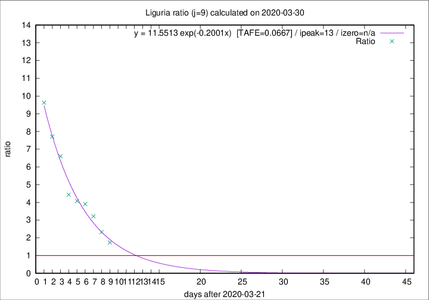

# Liguria

Data source: https://raw.githubusercontent.com/pcm-dpc/COVID-19/master/dati-json/dpc-covid19-ita-regioni.json

Delta days analysis (j): 9

Analyses for other values of j for 2020-03-30 are avalable [here](../README.md)

Analyses for Liguria for previous dates are avalable [here](../../README.md)

## Fitting 
|fit type|best fit equation|tafe|tfe|ipeak|izero|
|-------|-----|--------|------|---|---|
|exp|y = 11.5513 exp(-0.2001x)  [TAFE=0.0667]|0.0667|0.0038|13|n/a|

## Data
|Date|Daily deaths|Cumulated deaths|Deaths in the last 9 days|Deaths in the 9 days before|ratio|
|----|----------|-----------|-------|--------------------|-----|
|2020-03-30|20|397|245|141|1.7376|
|2020-03-29|19|377|258|111|2.3243|
|2020-03-28|27|358|267|83|3.2169|
|2020-03-27|51|331|258|66|3.9091|
|2020-03-26|26|280|220|54|4.0741|
|2020-03-25|23|254|204|46|4.4348|
|2020-03-24|19|231|198|30|6.6000|
|2020-03-23|41|212|185|24|7.7083|
|2020-03-22|19|171|154|16|9.6250|

[Download data as CSV](COVID-19_liguria_j9_2020-03-30.csv)

Generated April 10th, 2020 at 17:26:10 UTC+0200 with https://github.com/robianc/COVID-19
