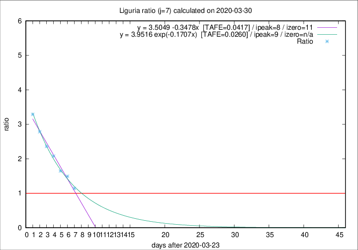

# Liguria

Data source: https://raw.githubusercontent.com/pcm-dpc/COVID-19/master/dati-json/dpc-covid19-ita-regioni.json

Estimates in this page were made on 16/4/2020 with data available until 30/03/2020.

## Summary 

### Peak estimate 
|j|linear [TAFE]|exponential [TAFE]|power law [TAFE]|details|
|---|----|-----------|---------|-------|
|7|1/4/2020 [TAFE=0.0417]|2/4/2020 [TAFE=0.0260]|6/4/2020 [TAFE=0.0904]|[analysis](COVID-19_liguria_j7_2020-03-30.md)|
|8|1/4/2020 [TAFE=0.1042]|3/4/2020 [TAFE=0.0623]|13/4/2020 [TAFE=0.1073]|[analysis](COVID-19_liguria_j8_2020-03-30.md)|
|9|1/4/2020 [TAFE=0.1242]|4/4/2020 [TAFE=0.0667]|22/4/2020 [TAFE=0.1544]|[analysis](COVID-19_liguria_j9_2020-03-30.md)|
|10|31/3/2020 [TAFE=0.2499]|5/4/2020 [TAFE=0.0728]|2/5/2020 [TAFE=0.1476]|[analysis](COVID-19_liguria_j10_2020-03-30.md)|
|11|1/4/2020 [TAFE=0.1747]|8/4/2020 [TAFE=0.1237]|-|[analysis](COVID-19_liguria_j11_2020-03-30.md)|
|12|3/4/2020 [TAFE=0.1547]|12/4/2020 [TAFE=0.1942]|-|[analysis](COVID-19_liguria_j12_2020-03-30.md)|
|13|-|-|-||
|14|-|-|-||

Best estimator is exp with j=7 (TAFE=0.0260)
Corresponding peak date estimate is 2/4/2020 (ipeak 9)

Peak date range estimate: 24/3/2020 - 5/5/2020

### End estimate 
|j|linear [TAFE/TFE]|exponential [TAFE/TFE]|power law [TAFE/TFE]|details|
|---|----|-----------|---------|-------|
|7|4/4/2020 [TAFE=0.0417]|-|-|[analysis](COVID-19_liguria_j7_2020-03-30.md)|
|8|-|-|-|[analysis](COVID-19_liguria_j8_2020-03-30.md)|
|9|-|-|-|[analysis](COVID-19_liguria_j9_2020-03-30.md)|
|10|-|-|-|[analysis](COVID-19_liguria_j10_2020-03-30.md)|
|11|-|-|-|[analysis](COVID-19_liguria_j11_2020-03-30.md)|
|12|-|-|-|[analysis](COVID-19_liguria_j12_2020-03-30.md)|
|13|-|-|-||
|14|-|-|-||

Best estimator is linear with j=7 (TAFE=0.0417)
Corresponding end date estimate is 4/4/2020 (izero 11)

End date range estimate: 24/3/2020 - 8/4/2020

Generated April 16th, 2020 at 20:09:19 UTC+0200 with https://github.com/robianc/COVID-19
