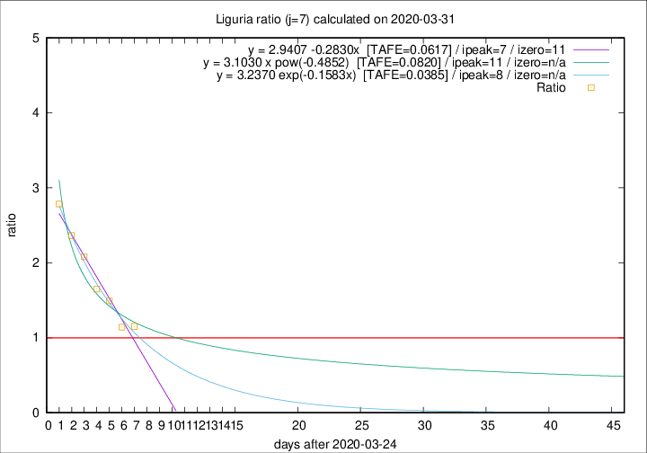

# Liguria

Data source: https://raw.githubusercontent.com/pcm-dpc/COVID-19/master/dati-json/dpc-covid19-ita-regioni.json

Delta days analysis (j): 7

## Fitting 
|fit type|best fit equation|tafe|tfe|ipeak|izero|
|-------|-----|--------|------|---|---|
|linear|y = 2.9407 -0.2830x  [TAFE=0.0617]|0.0617|0.0010|7|11|
|exp|y = 3.2370 exp(-0.1583x)  [TAFE=0.0385]|0.0385|0.0013|8|n/a|
|pow|y = 3.1030 x pow(-0.4852)  [TAFE=0.0820]|0.0820|0.0041|11|n/a|

## Data
|Date|Daily deaths|Cumulated deaths|Deaths in the last 7 days|Deaths in the 7 days before|ratio|
|----|----------|-----------|-------|--------------------|-----|
|2020-03-31|31|428|197|171|1.1520|
|2020-03-30|20|397|185|162|1.1420|
|2020-03-29|19|377|206|138|1.4928|
|2020-03-28|27|358|206|125|1.6480|
|2020-03-27|51|331|212|102|2.0784|
|2020-03-26|26|280|189|80|2.3625|
|2020-03-25|23|254|181|65|2.7846|

[Download data as CSV](COVID-19_liguria_j7_2020-03-31.csv)

Generated April 8th, 2020 at 23:43:36 UTC+0200 with https://github.com/robianc/COVID-19
