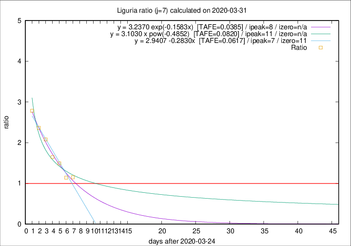
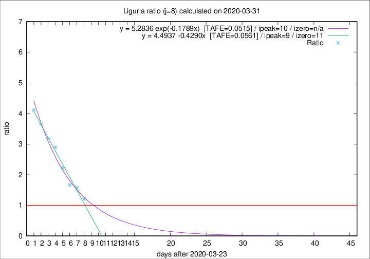

# Liguria

Data source: https://raw.githubusercontent.com/pcm-dpc/COVID-19/master/dati-json/dpc-covid19-ita-regioni.json

Estimates in this page were made on 12/4/2020 with data available until 31/03/2020.

## Summary 

### Peak estimate 
|j|linear [TAFE]|exponential [TAFE]|power law [TAFE]|details|
|---|----|-----------|---------|-------|
|7|1/4/2020 [TAFE=0.0617]|2/4/2020 [TAFE=0.0385]|5/4/2020 [TAFE=0.0820]|[analysis](COVID-19_liguria_j7_2020-03-31.md)|
|8|2/4/2020 [TAFE=0.0561]|3/4/2020 [TAFE=0.0515]|10/4/2020 [TAFE=0.1454]|[analysis](COVID-19_liguria_j8_2020-03-31.md)|
|9|2/4/2020 [TAFE=0.1157]|4/4/2020 [TAFE=0.0734]|17/4/2020 [TAFE=0.1528]|[analysis](COVID-19_liguria_j9_2020-03-31.md)|
|10|1/4/2020 [TAFE=0.2322]|5/4/2020 [TAFE=0.0763]|24/4/2020 [TAFE=0.1608]|[analysis](COVID-19_liguria_j10_2020-03-31.md)|
|11|1/4/2020 [TAFE=0.2442]|7/4/2020 [TAFE=0.0824]|16/5/2020 [TAFE=0.2220]|[analysis](COVID-19_liguria_j11_2020-03-31.md)|
|12|2/4/2020 [TAFE=0.1731]|10/4/2020 [TAFE=0.1664]|-|[analysis](COVID-19_liguria_j12_2020-03-31.md)|
|13|-|-|-||
|14|-|-|-||

Best estimator is exp with j=7 (TAFE=0.0385)
Corresponding peak date estimate is 2/4/2020 (ipeak 8)

Peak date range estimate: 25/3/2020 - 20/5/2020

### End estimate 
|j|linear [TAFE/TFE]|exponential [TAFE/TFE]|power law [TAFE/TFE]|details|
|---|----|-----------|---------|-------|
|7|5/4/2020 [TAFE=0.0617]|-|-|[analysis](COVID-19_liguria_j7_2020-03-31.md)|
|8|4/4/2020 [TAFE=0.0561]|-|-|[analysis](COVID-19_liguria_j8_2020-03-31.md)|
|9|-|-|-|[analysis](COVID-19_liguria_j9_2020-03-31.md)|
|10|-|-|-|[analysis](COVID-19_liguria_j10_2020-03-31.md)|
|11|-|-|-|[analysis](COVID-19_liguria_j11_2020-03-31.md)|
|12|-|-|-|[analysis](COVID-19_liguria_j12_2020-03-31.md)|
|13|-|-|-||
|14|-|-|-||

Best estimator is linear with j=8 (TAFE=0.0561)
Corresponding end date estimate is 4/4/2020 (izero 11)

End date range estimate: 24/3/2020 - 7/4/2020

Generated April 12th, 2020 at 17:02:01 UTC+0200 with https://github.com/robianc/COVID-19
