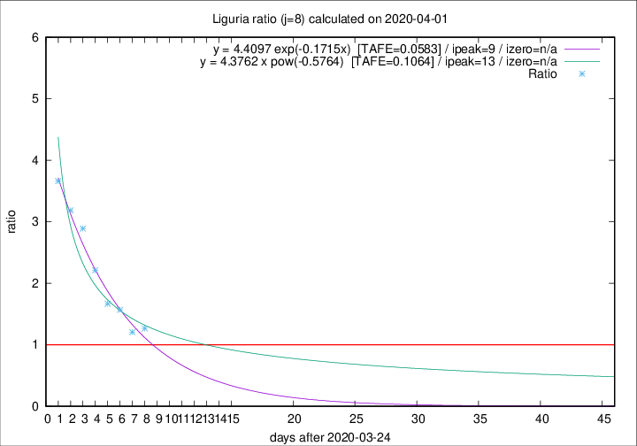

# Liguria

Data source: https://raw.githubusercontent.com/pcm-dpc/COVID-19/master/dati-json/dpc-covid19-ita-regioni.json

Delta days analysis (j): 8

Analyses for other values of j for 2020-04-01 are avalable [here](../README.md)

Analyses for Liguria for previous dates are avalable [here](../../README.md)

## Fitting 
|fit type|best fit equation|tafe|tfe|ipeak|izero|
|-------|-----|--------|------|---|---|
|exp|y = 4.4097 exp(-0.1715x)  [TAFE=0.0583]|0.0583|0.0029|9|n/a|
|pow|y = 4.3762 x pow(-0.5764)  [TAFE=0.1064]|0.1064|0.0082|13|n/a|

## Data
|Date|Daily deaths|Cumulated deaths|Deaths in the last 8 days|Deaths in the 8 days before|ratio|
|----|----------|-----------|-------|--------------------|-----|
|2020-04-01|32|460|229|181|1.2652|
|2020-03-31|31|428|216|179|1.2067|
|2020-03-30|20|397|226|144|1.5694|
|2020-03-29|19|377|225|135|1.6667|
|2020-03-28|27|358|239|108|2.2130|
|2020-03-27|51|331|240|83|2.8916|
|2020-03-26|26|280|207|65|3.1846|
|2020-03-25|23|254|194|53|3.6604|

[Download data as CSV](COVID-19_liguria_j8_2020-04-01.csv)

Generated April 12th, 2020 at 16:28:18 UTC+0200 with https://github.com/robianc/COVID-19
