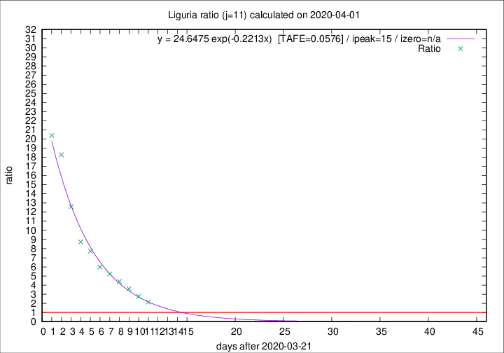
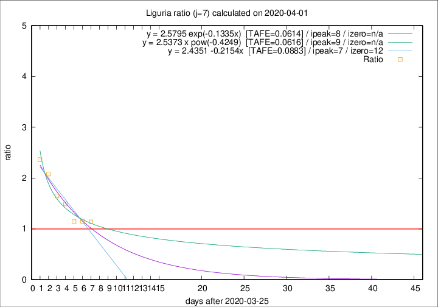

# Liguria

Data source: https://raw.githubusercontent.com/pcm-dpc/COVID-19/master/dati-json/dpc-covid19-ita-regioni.json

Estimates in this page were made on 10/4/2020 with data available until 01/04/2020.

## Summary 

### Peak estimate 
|j|linear [TAFE]|exponential [TAFE]|power law [TAFE]|details|
|---|----|-----------|---------|-------|
|7|2/4/2020 [TAFE=0.0883]|3/4/2020 [TAFE=0.0614]|4/4/2020 [TAFE=0.0616]|[analysis](COVID-19_liguria_j7_2020-04-01.md)|
|8|2/4/2020 [TAFE=0.0987]|3/4/2020 [TAFE=0.0583]|7/4/2020 [TAFE=0.1064]|[analysis](COVID-19_liguria_j8_2020-04-01.md)|
|9|2/4/2020 [TAFE=0.1326]|4/4/2020 [TAFE=0.0723]|12/4/2020 [TAFE=0.1516]|[analysis](COVID-19_liguria_j9_2020-04-01.md)|
|10|2/4/2020 [TAFE=0.1842]|5/4/2020 [TAFE=0.0813]|19/4/2020 [TAFE=0.1583]|[analysis](COVID-19_liguria_j10_2020-04-01.md)|
|11|2/4/2020 [TAFE=0.3292]|6/4/2020 [TAFE=0.0576]|27/4/2020 [TAFE=0.1783]|[analysis](COVID-19_liguria_j11_2020-04-01.md)|
|12|2/4/2020 [TAFE=0.2422]|8/4/2020 [TAFE=0.1225]|3/6/2020 [TAFE=0.2925]|[analysis](COVID-19_liguria_j12_2020-04-01.md)|
|13|-|-|-||
|14|-|-|-||

Best estimator is exp with j=11 (TAFE=0.0576)
Corresponding peak date estimate is 6/4/2020 (ipeak 15)

Peak date range estimate: 22/3/2020 - 4/6/2020

### End estimate 
|j|linear [TAFE/TFE]|exponential [TAFE/TFE]|power law [TAFE/TFE]|details|
|---|----|-----------|---------|-------|
|7|7/4/2020 [TAFE=0.0883]|-|-|[analysis](COVID-19_liguria_j7_2020-04-01.md)|
|8|-|-|-|[analysis](COVID-19_liguria_j8_2020-04-01.md)|
|9|-|-|-|[analysis](COVID-19_liguria_j9_2020-04-01.md)|
|10|-|-|-|[analysis](COVID-19_liguria_j10_2020-04-01.md)|
|11|-|-|-|[analysis](COVID-19_liguria_j11_2020-04-01.md)|
|12|-|-|-|[analysis](COVID-19_liguria_j12_2020-04-01.md)|
|13|-|-|-||
|14|-|-|-||

Best estimator is linear with j=7 (TAFE=0.0883)
Corresponding end date estimate is 7/4/2020 (izero 12)

End date range estimate: 26/3/2020 - 8/4/2020

Generated April 10th, 2020 at 17:26:10 UTC+0200 with https://github.com/robianc/COVID-19
