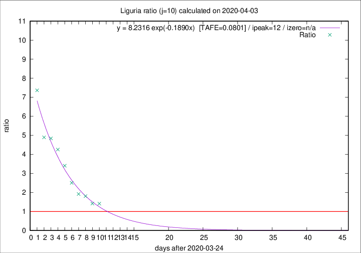

# Liguria

Data source: https://raw.githubusercontent.com/pcm-dpc/COVID-19/master/dati-json/dpc-covid19-ita-regioni.json

Delta days analysis (j): 10

Analyses for other values of j for 2020-04-03 are avalable [here](../2020-04-03/README.md)

Analyses for Liguria for previous dates are avalable [here](../README.md)

## Fitting 
|fit type|best fit equation|tafe|tfe|ipeak|izero|
|-------|-----|--------|------|---|---|
|exp|y = 8.2316 exp(-0.1890x)  [TAFE=0.0801]|0.0801|0.0039|12|n/a|

## Data
|Date|Daily deaths|Cumulated deaths|Deaths in the last 10 days|Deaths in the 10 days before|ratio|
|----|----------|-----------|-------|--------------------|-----|
|2020-04-03|31|519|288|204|1.4118|
|2020-04-02|28|488|276|195|1.4154|
|2020-04-01|32|460|289|160|1.8062|
|2020-03-31|31|428|276|144|1.9167|
|2020-03-30|20|397|278|111|2.5045|
|2020-03-29|19|377|286|84|3.4048|
|2020-03-28|27|358|285|67|4.2537|
|2020-03-27|51|331|271|56|4.8393|
|2020-03-26|26|280|230|47|4.8936|
|2020-03-25|23|254|221|30|7.3667|

[Download data as CSV](COVID-19_liguria_j10_2020-04-03.csv)

Generated April 12th, 2020 at 17:02:01 UTC+0200 with https://github.com/robianc/COVID-19
