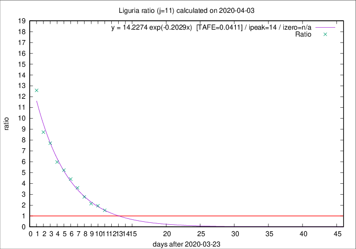

# Liguria

Data source: https://raw.githubusercontent.com/pcm-dpc/COVID-19/master/dati-json/dpc-covid19-ita-regioni.json

Delta days analysis (j): 11

Analyses for other values of j for 2020-04-03 are avalable [here](../README.md)

Analyses for Liguria for previous dates are avalable [here](../../README.md)

## Fitting 
|fit type|best fit equation|tafe|tfe|ipeak|izero|
|-------|-----|--------|------|---|---|
|exp|y = 14.2274 exp(-0.2029x)  [TAFE=0.0411]|0.0411|0.0014|14|n/a|

## Data
|Date|Daily deaths|Cumulated deaths|Deaths in the last 11 days|Deaths in the 11 days before|ratio|
|----|----------|-----------|-------|--------------------|-----|
|2020-04-03|31|519|307|201|1.5274|
|2020-04-02|28|488|317|163|1.9448|
|2020-04-01|32|460|308|144|2.1389|
|2020-03-31|31|428|309|112|2.7589|
|2020-03-30|20|397|306|85|3.6000|
|2020-03-29|19|377|304|69|4.4058|
|2020-03-28|27|358|298|57|5.2281|
|2020-03-27|51|331|281|47|5.9787|
|2020-03-26|26|280|247|32|7.7188|
|2020-03-25|23|254|227|26|8.7308|
|2020-03-24|19|231|214|17|12.5882|

[Download data as CSV](COVID-19_liguria_j11_2020-04-03.csv)

Generated April 12th, 2020 at 16:28:18 UTC+0200 with https://github.com/robianc/COVID-19
