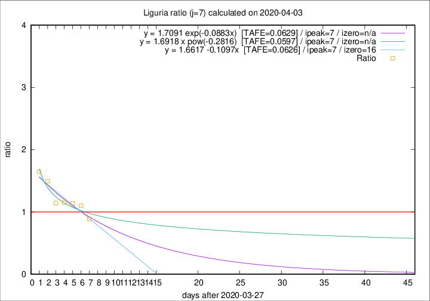

# Liguria

Data source: https://raw.githubusercontent.com/pcm-dpc/COVID-19/master/dati-json/dpc-covid19-ita-regioni.json

Delta days analysis (j): 7

Analyses for other values of j for 2020-04-03 are avalable [here](../2020-04-03/README.md)

Analyses for Liguria for previous dates are avalable [here](../README.md)

## Fitting 
|fit type|best fit equation|tafe|tfe|ipeak|izero|
|-------|-----|--------|------|---|---|
|linear|y = 1.6617 -0.1097x  [TAFE=0.0626]|0.0626|0.0049|7|16|
|exp|y = 1.7091 exp(-0.0883x)  [TAFE=0.0629]|0.0629|0.0026|7|n/a|
|pow|y = 1.6918 x pow(-0.2816)  [TAFE=0.0597]|0.0597|0.0023|7|n/a|

## Data
|Date|Daily deaths|Cumulated deaths|Deaths in the last 7 days|Deaths in the 7 days before|ratio|
|----|----------|-----------|-------|--------------------|-----|
|2020-04-03|31|519|188|212|0.8868|
|2020-04-02|28|488|208|189|1.1005|
|2020-04-01|32|460|206|181|1.1381|
|2020-03-31|31|428|197|171|1.1520|
|2020-03-30|20|397|185|162|1.1420|
|2020-03-29|19|377|206|138|1.4928|
|2020-03-28|27|358|206|125|1.6480|

[Download data as CSV](COVID-19_liguria_j7_2020-04-03.csv)

Generated April 19th, 2020 at 18:42:39 UTC+0200 with https://github.com/robianc/COVID-19
