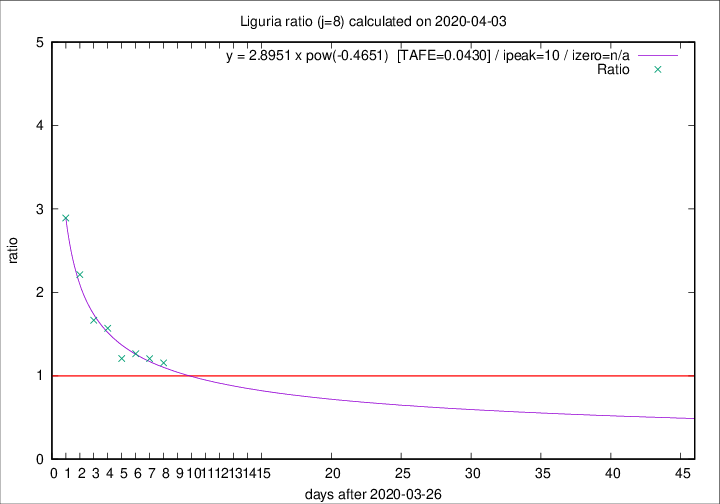

# Liguria

Data source: https://raw.githubusercontent.com/pcm-dpc/COVID-19/master/dati-json/dpc-covid19-ita-regioni.json

Delta days analysis (j): 8

## Fitting 
|fit type|best fit equation|tafe|tfe|ipeak|izero|
|-------|-----|--------|------|---|---|
|pow|y = 2.8951 x pow(-0.4651)  [TAFE=0.0430]|0.0430|0.0016|10|n/a|

## Data
|Date|Daily deaths|Cumulated deaths|Deaths in the last 8 days|Deaths in the 8 days before|ratio|
|----|----------|-----------|-------|--------------------|-----|
|2020-04-03|31|519|239|207|1.1546|
|2020-04-02|28|488|234|194|1.2062|
|2020-04-01|32|460|229|181|1.2652|
|2020-03-31|31|428|216|179|1.2067|
|2020-03-30|20|397|226|144|1.5694|
|2020-03-29|19|377|225|135|1.6667|
|2020-03-28|27|358|239|108|2.2130|
|2020-03-27|51|331|240|83|2.8916|

[Download data as CSV](COVID-19_liguria_j8_2020-04-03.csv)

Generated April 8th, 2020 at 23:43:36 UTC+0200 with https://github.com/robianc/COVID-19
