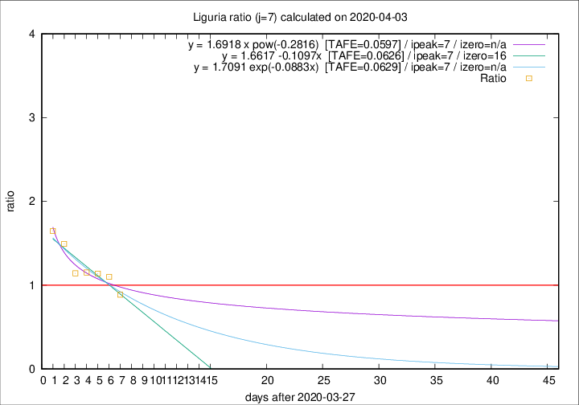

# Liguria

Data source: https://raw.githubusercontent.com/pcm-dpc/COVID-19/master/dati-json/dpc-covid19-ita-regioni.json

Estimates in this page were made on 12/4/2020 with data available until 03/04/2020.

## Summary 

### Peak estimate 
|j|linear [TAFE]|exponential [TAFE]|power law [TAFE]|details|
|---|----|-----------|---------|-------|
|7|4/4/2020 [TAFE=0.0626]|4/4/2020 [TAFE=0.0629]|4/4/2020 [TAFE=0.0597]|[analysis](COVID-19_liguria_j7_2020-04-03.md)|
|8|4/4/2020 [TAFE=0.1413]|5/4/2020 [TAFE=0.1010]|6/4/2020 [TAFE=0.0430]|[analysis](COVID-19_liguria_j8_2020-04-03.md)|
|9|4/4/2020 [TAFE=0.1695]|5/4/2020 [TAFE=0.0950]|9/4/2020 [TAFE=0.1072]|[analysis](COVID-19_liguria_j9_2020-04-03.md)|
|10|4/4/2020 [TAFE=0.1623]|6/4/2020 [TAFE=0.0801]|13/4/2020 [TAFE=0.1534]|[analysis](COVID-19_liguria_j10_2020-04-03.md)|
|11|4/4/2020 [TAFE=0.2136]|7/4/2020 [TAFE=0.0411]|19/4/2020 [TAFE=0.1772]|[analysis](COVID-19_liguria_j11_2020-04-03.md)|
|12|3/4/2020 [TAFE=0.4396]|7/4/2020 [TAFE=0.0745]|24/4/2020 [TAFE=0.1746]|[analysis](COVID-19_liguria_j12_2020-04-03.md)|
|13|4/4/2020 [TAFE=0.3381]|9/4/2020 [TAFE=0.1060]|19/5/2020 [TAFE=0.3112]|[analysis](COVID-19_liguria_j13_2020-04-03.md)|
|14|-|-|-||

Best estimator is exp with j=11 (TAFE=0.0411)
Corresponding peak date estimate is 7/4/2020 (ipeak 14)

Peak date range estimate: 24/3/2020 - 21/5/2020

### End estimate 
|j|linear [TAFE/TFE]|exponential [TAFE/TFE]|power law [TAFE/TFE]|details|
|---|----|-----------|---------|-------|
|7|13/4/2020 [TAFE=0.0626]|-|-|[analysis](COVID-19_liguria_j7_2020-04-03.md)|
|8|-|-|-|[analysis](COVID-19_liguria_j8_2020-04-03.md)|
|9|-|-|-|[analysis](COVID-19_liguria_j9_2020-04-03.md)|
|10|-|-|-|[analysis](COVID-19_liguria_j10_2020-04-03.md)|
|11|-|-|-|[analysis](COVID-19_liguria_j11_2020-04-03.md)|
|12|-|-|-|[analysis](COVID-19_liguria_j12_2020-04-03.md)|
|13|-|-|-|[analysis](COVID-19_liguria_j13_2020-04-03.md)|
|14|-|-|-||

Best estimator is linear with j=7 (TAFE=0.0626)
Corresponding end date estimate is 13/4/2020 (izero 16)

End date range estimate: 28/3/2020 - 13/4/2020

Generated April 12th, 2020 at 16:28:18 UTC+0200 with https://github.com/robianc/COVID-19
