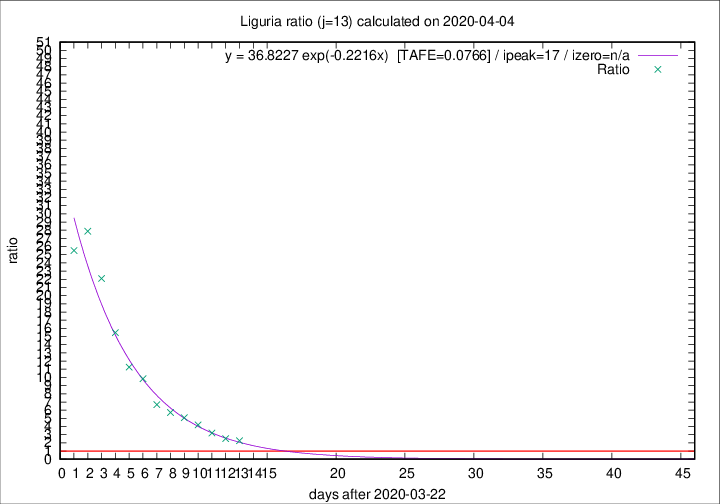

# Liguria

Data source: https://raw.githubusercontent.com/pcm-dpc/COVID-19/master/dati-json/dpc-covid19-ita-regioni.json

Delta days analysis (j): 13

## Fitting 
|fit type|best fit equation|tafe|tfe|ipeak|izero|
|-------|-----|--------|------|---|---|
|exp|y = 36.8227 exp(-0.2216x)  [TAFE=0.0766]|0.0766|0.0049|17|n/a|

## Data
|Date|Daily deaths|Cumulated deaths|Deaths in the last 13 days|Deaths in the 13 days before|ratio|
|----|----------|-----------|-------|--------------------|-----|
|2020-04-04|23|542|371|164|2.2622|
|2020-04-03|31|519|367|146|2.5137|
|2020-04-02|28|488|369|115|3.2087|
|2020-04-01|32|460|369|88|4.1932|
|2020-03-31|31|428|355|70|5.0714|
|2020-03-30|20|397|337|59|5.7119|
|2020-03-29|19|377|327|49|6.6735|
|2020-03-28|27|358|325|33|9.8485|
|2020-03-27|51|331|304|27|11.2593|
|2020-03-26|26|280|263|17|15.4706|
|2020-03-25|23|254|243|11|22.0909|
|2020-03-24|19|231|223|8|27.8750|
|2020-03-23|41|212|204|8|25.5000|

[Download data as CSV](COVID-19_liguria_j13_2020-04-04.csv)

Generated April 9th, 2020 at 16:40:48 UTC+0200 with https://github.com/robianc/COVID-19
