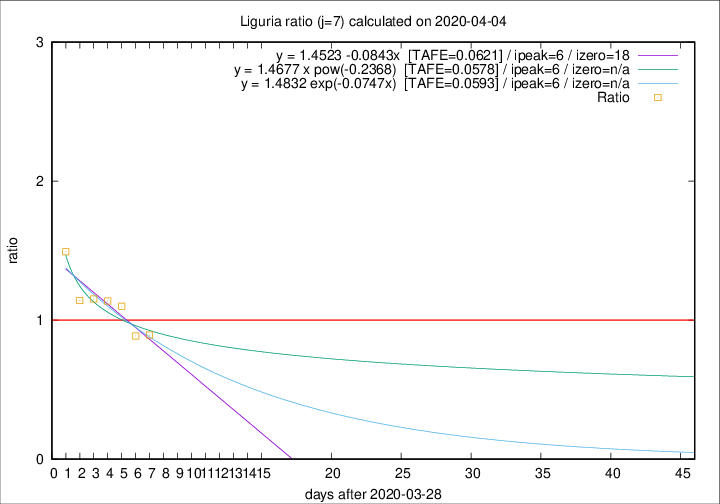

# Liguria

Data source: https://raw.githubusercontent.com/pcm-dpc/COVID-19/master/dati-json/dpc-covid19-ita-regioni.json

Estimates in this page were made on 10/4/2020 with data available until 04/04/2020.

## Summary 

### Peak estimate 
|j|linear [TAFE]|exponential [TAFE]|power law [TAFE]|details|
|---|----|-----------|---------|-------|
|7|4/4/2020 [TAFE=0.0621]|4/4/2020 [TAFE=0.0593]|4/4/2020 [TAFE=0.0578]|[analysis](COVID-19_liguria_j7_2020-04-04.md)|
|8|5/4/2020 [TAFE=0.0847]|5/4/2020 [TAFE=0.0719]|6/4/2020 [TAFE=0.0663]|[analysis](COVID-19_liguria_j8_2020-04-04.md)|
|9|5/4/2020 [TAFE=0.1998]|6/4/2020 [TAFE=0.1237]|8/4/2020 [TAFE=0.0614]|[analysis](COVID-19_liguria_j9_2020-04-04.md)|
|10|5/4/2020 [TAFE=0.1662]|6/4/2020 [TAFE=0.0939]|13/4/2020 [TAFE=0.1490]|[analysis](COVID-19_liguria_j10_2020-04-04.md)|
|11|5/4/2020 [TAFE=0.1796]|7/4/2020 [TAFE=0.0448]|17/4/2020 [TAFE=0.1845]|[analysis](COVID-19_liguria_j11_2020-04-04.md)|
|12|4/4/2020 [TAFE=0.3757]|8/4/2020 [TAFE=0.0634]|21/4/2020 [TAFE=0.1691]|[analysis](COVID-19_liguria_j12_2020-04-04.md)|
|13|4/4/2020 [TAFE=0.4507]|9/4/2020 [TAFE=0.0766]|2/5/2020 [TAFE=0.2575]|[analysis](COVID-19_liguria_j13_2020-04-04.md)|
|14|-|-|-||

Best estimator is exp with j=11 (TAFE=0.0448)
Corresponding peak date estimate is 7/4/2020 (ipeak 13)

Peak date range estimate: 25/3/2020 - 4/5/2020

### End estimate 
|j|linear [TAFE/TFE]|exponential [TAFE/TFE]|power law [TAFE/TFE]|details|
|---|----|-----------|---------|-------|
|7|16/4/2020 [TAFE=0.0621]|-|-|[analysis](COVID-19_liguria_j7_2020-04-04.md)|
|8|-|-|-|[analysis](COVID-19_liguria_j8_2020-04-04.md)|
|9|-|-|-|[analysis](COVID-19_liguria_j9_2020-04-04.md)|
|10|-|-|-|[analysis](COVID-19_liguria_j10_2020-04-04.md)|
|11|-|-|-|[analysis](COVID-19_liguria_j11_2020-04-04.md)|
|12|-|-|-|[analysis](COVID-19_liguria_j12_2020-04-04.md)|
|13|-|-|-|[analysis](COVID-19_liguria_j13_2020-04-04.md)|
|14|-|-|-||

Best estimator is linear with j=7 (TAFE=0.0621)
Corresponding end date estimate is 16/4/2020 (izero 18)

End date range estimate: 29/3/2020 - 16/4/2020

Generated April 10th, 2020 at 17:26:10 UTC+0200 with https://github.com/robianc/COVID-19
