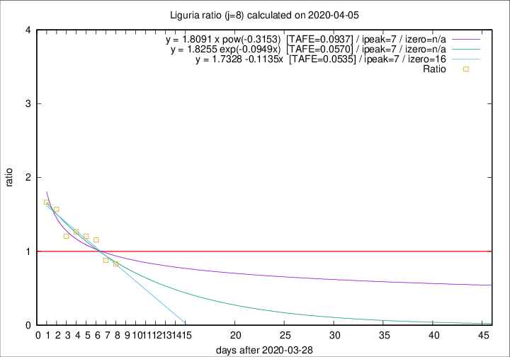

# Liguria

Data source: https://raw.githubusercontent.com/pcm-dpc/COVID-19/master/dati-json/dpc-covid19-ita-regioni.json

Delta days analysis (j): 8

Analyses for other values of j for 2020-04-05 are avalable [here](../2020-04-05/README.md)

Analyses for Liguria for previous dates are avalable [here](../README.md)

## Fitting 
|fit type|best fit equation|tafe|tfe|ipeak|izero|
|-------|-----|--------|------|---|---|
|linear|y = 1.7328 -0.1135x  [TAFE=0.0535]|0.0535|0.0044|7|16|
|exp|y = 1.8255 exp(-0.0949x)  [TAFE=0.0570]|0.0570|0.0024|7|n/a|
|pow|y = 1.8091 x pow(-0.3153)  [TAFE=0.0937]|0.0937|0.0046|7|n/a|

## Data
|Date|Daily deaths|Cumulated deaths|Deaths in the last 8 days|Deaths in the 8 days before|ratio|
|----|----------|-----------|-------|--------------------|-----|
|2020-04-05|14|556|198|239|0.8285|
|2020-04-04|23|542|211|240|0.8792|
|2020-04-03|31|519|239|207|1.1546|
|2020-04-02|28|488|234|194|1.2062|
|2020-04-01|32|460|229|181|1.2652|
|2020-03-31|31|428|216|179|1.2067|
|2020-03-30|20|397|226|144|1.5694|
|2020-03-29|19|377|225|135|1.6667|

[Download data as CSV](COVID-19_liguria_j8_2020-04-05.csv)

Generated April 14th, 2020 at 19:16:04 UTC+0200 with https://github.com/robianc/COVID-19
