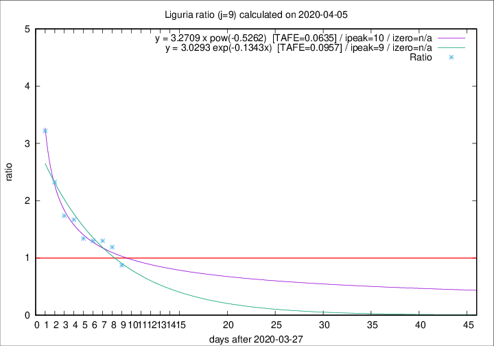

# Liguria

Data source: https://raw.githubusercontent.com/pcm-dpc/COVID-19/master/dati-json/dpc-covid19-ita-regioni.json

Delta days analysis (j): 9

## Fitting 
|fit type|best fit equation|tafe|tfe|ipeak|izero|
|-------|-----|--------|------|---|---|
|exp|y = 3.0293 exp(-0.1343x)  [TAFE=0.0957]|0.0957|0.0066|9|n/a|
|pow|y = 3.2709 x pow(-0.5262)  [TAFE=0.0635]|0.0635|0.0030|10|n/a|

## Data
|Date|Daily deaths|Cumulated deaths|Deaths in the last 9 days|Deaths in the 9 days before|ratio|
|----|----------|-----------|-------|--------------------|-----|
|2020-04-05|14|556|225|258|0.8721|
|2020-04-04|23|542|262|220|1.1909|
|2020-04-03|31|519|265|204|1.2990|
|2020-04-02|28|488|257|198|1.2980|
|2020-04-01|32|460|248|185|1.3405|
|2020-03-31|31|428|257|154|1.6688|
|2020-03-30|20|397|245|141|1.7376|
|2020-03-29|19|377|258|111|2.3243|
|2020-03-28|27|358|267|83|3.2169|

[Download data as CSV](COVID-19_liguria_j9_2020-04-05.csv)

Generated April 9th, 2020 at 16:40:48 UTC+0200 with https://github.com/robianc/COVID-19
