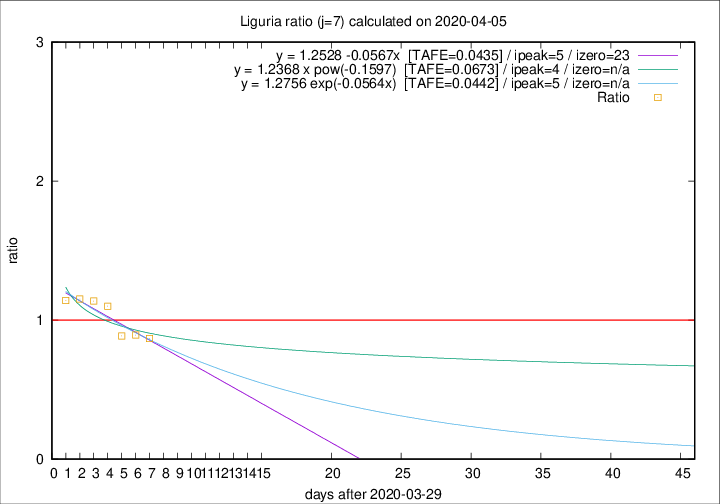

# Liguria

Data source: https://raw.githubusercontent.com/pcm-dpc/COVID-19/master/dati-json/dpc-covid19-ita-regioni.json

Estimates in this page were made on 14/4/2020 with data available until 05/04/2020.

## Summary 

### Peak estimate 
|j|linear [TAFE]|exponential [TAFE]|power law [TAFE]|details|
|---|----|-----------|---------|-------|
|7|4/4/2020 [TAFE=0.0435]|4/4/2020 [TAFE=0.0442]|3/4/2020 [TAFE=0.0673]|[analysis](COVID-19_liguria_j7_2020-04-05.md)|
|8|5/4/2020 [TAFE=0.0535]|5/4/2020 [TAFE=0.0570]|5/4/2020 [TAFE=0.0937]|[analysis](COVID-19_liguria_j8_2020-04-05.md)|
|9|5/4/2020 [TAFE=0.1502]|6/4/2020 [TAFE=0.0957]|7/4/2020 [TAFE=0.0635]|[analysis](COVID-19_liguria_j9_2020-04-05.md)|
|10|5/4/2020 [TAFE=0.2051]|7/4/2020 [TAFE=0.1037]|10/4/2020 [TAFE=0.0873]|[analysis](COVID-19_liguria_j10_2020-04-05.md)|
|11|6/4/2020 [TAFE=0.1985]|7/4/2020 [TAFE=0.0602]|14/4/2020 [TAFE=0.1421]|[analysis](COVID-19_liguria_j11_2020-04-05.md)|
|12|5/4/2020 [TAFE=0.2944]|8/4/2020 [TAFE=0.0571]|19/4/2020 [TAFE=0.1936]|[analysis](COVID-19_liguria_j12_2020-04-05.md)|
|13|5/4/2020 [TAFE=0.5415]|9/4/2020 [TAFE=0.0658]|23/4/2020 [TAFE=0.2065]|[analysis](COVID-19_liguria_j13_2020-04-05.md)|
|14|5/4/2020 [TAFE=0.4482]|10/4/2020 [TAFE=0.0993]|10/5/2020 [TAFE=0.3189]|[analysis](COVID-19_liguria_j14_2020-04-05.md)|

Best estimator is linear with j=7 (TAFE=0.0435)
Corresponding peak date estimate is 4/4/2020 (ipeak 5)

Peak date range estimate: 3/4/2020 - 17/5/2020

### End estimate 
|j|linear [TAFE/TFE]|exponential [TAFE/TFE]|power law [TAFE/TFE]|details|
|---|----|-----------|---------|-------|
|7|22/4/2020 [TAFE=0.0435]|-|-|[analysis](COVID-19_liguria_j7_2020-04-05.md)|
|8|-|-|-|[analysis](COVID-19_liguria_j8_2020-04-05.md)|
|9|-|-|-|[analysis](COVID-19_liguria_j9_2020-04-05.md)|
|10|-|-|-|[analysis](COVID-19_liguria_j10_2020-04-05.md)|
|11|-|-|-|[analysis](COVID-19_liguria_j11_2020-04-05.md)|
|12|-|-|-|[analysis](COVID-19_liguria_j12_2020-04-05.md)|
|13|-|-|-|[analysis](COVID-19_liguria_j13_2020-04-05.md)|
|14|-|-|-|[analysis](COVID-19_liguria_j14_2020-04-05.md)|

Best estimator is linear with j=7 (TAFE=0.0435)
Corresponding end date estimate is 22/4/2020 (izero 23)

End date range estimate: 30/3/2020 - 22/4/2020

Generated April 14th, 2020 at 19:16:04 UTC+0200 with https://github.com/robianc/COVID-19
