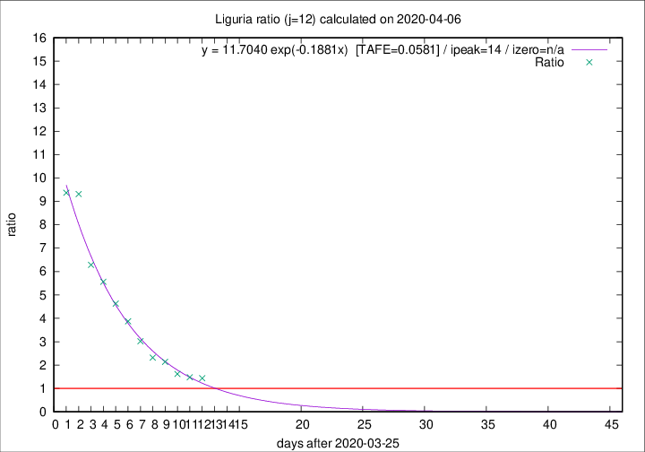

# Liguria

Data source: https://raw.githubusercontent.com/pcm-dpc/COVID-19/master/dati-json/dpc-covid19-ita-regioni.json

Delta days analysis (j): 12

Analyses for other values of j for 2020-04-06 are avalable [here](../2020-04-06/README.md)

Analyses for Liguria for previous dates are avalable [here](../README.md)

## Fitting 
|fit type|best fit equation|tafe|tfe|ipeak|izero|
|-------|-----|--------|------|---|---|
|exp|y = 11.7040 exp(-0.1881x)  [TAFE=0.0581]|0.0581|0.0031|14|n/a|

## Data
|Date|Daily deaths|Cumulated deaths|Deaths in the last 12 days|Deaths in the 12 days before|ratio|
|----|----------|-----------|-------|--------------------|-----|
|2020-04-06|39|595|341|237|1.4388|
|2020-04-05|14|556|325|220|1.4773|
|2020-04-04|23|542|330|204|1.6176|
|2020-04-03|31|519|348|163|2.1350|
|2020-04-02|28|488|336|145|2.3172|
|2020-04-01|32|460|341|113|3.0177|
|2020-03-31|31|428|337|87|3.8736|
|2020-03-30|20|397|324|70|4.6286|
|2020-03-29|19|377|317|57|5.5614|
|2020-03-28|27|358|308|49|6.2857|
|2020-03-27|51|331|298|32|9.3125|
|2020-03-26|26|280|253|27|9.3704|

[Download data as CSV](COVID-19_liguria_j12_2020-04-06.csv)

Generated April 14th, 2020 at 19:16:04 UTC+0200 with https://github.com/robianc/COVID-19
