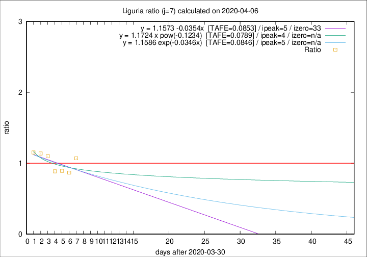

# Liguria

Data source: https://raw.githubusercontent.com/pcm-dpc/COVID-19/master/dati-json/dpc-covid19-ita-regioni.json

Delta days analysis (j): 7

Analyses for other values of j for 2020-04-06 are avalable [here](../README.md)

Analyses for Liguria for previous dates are avalable [here](../../README.md)

## Fitting 
|fit type|best fit equation|tafe|tfe|ipeak|izero|
|-------|-----|--------|------|---|---|
|linear|y = 1.1573 -0.0354x  [TAFE=0.0853]|0.0853|0.0091|5|33|
|exp|y = 1.1586 exp(-0.0346x)  [TAFE=0.0846]|0.0846|0.0046|5|n/a|
|pow|y = 1.1724 x pow(-0.1234)  [TAFE=0.0789]|0.0789|0.0039|4|n/a|

## Data
|Date|Daily deaths|Cumulated deaths|Deaths in the last 7 days|Deaths in the 7 days before|ratio|
|----|----------|-----------|-------|--------------------|-----|
|2020-04-06|39|595|198|185|1.0703|
|2020-04-05|14|556|179|206|0.8689|
|2020-04-04|23|542|184|206|0.8932|
|2020-04-03|31|519|188|212|0.8868|
|2020-04-02|28|488|208|189|1.1005|
|2020-04-01|32|460|206|181|1.1381|
|2020-03-31|31|428|197|171|1.1520|

[Download data as CSV](COVID-19_liguria_j7_2020-04-06.csv)

Generated April 10th, 2020 at 17:26:10 UTC+0200 with https://github.com/robianc/COVID-19
