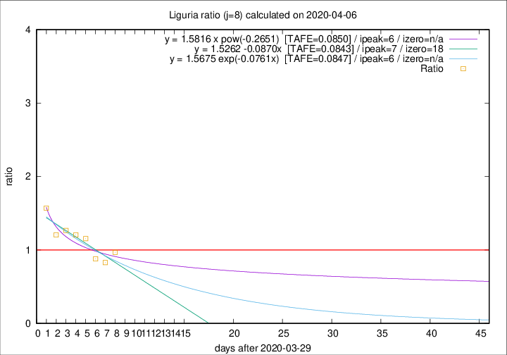

# Liguria

Data source: https://raw.githubusercontent.com/pcm-dpc/COVID-19/master/dati-json/dpc-covid19-ita-regioni.json

Delta days analysis (j): 8

Analyses for other values of j for 2020-04-06 are avalable [here](../2020-04-06/README.md)

Analyses for Liguria for previous dates are avalable [here](../README.md)

## Fitting 
|fit type|best fit equation|tafe|tfe|ipeak|izero|
|-------|-----|--------|------|---|---|
|linear|y = 1.5262 -0.0870x  [TAFE=0.0843]|0.0843|0.0082|7|18|
|exp|y = 1.5675 exp(-0.0761x)  [TAFE=0.0847]|0.0847|0.0042|6|n/a|
|pow|y = 1.5816 x pow(-0.2651)  [TAFE=0.0850]|0.0850|0.0042|6|n/a|

## Data
|Date|Daily deaths|Cumulated deaths|Deaths in the last 8 days|Deaths in the 8 days before|ratio|
|----|----------|-----------|-------|--------------------|-----|
|2020-04-06|39|595|218|225|0.9689|
|2020-04-05|14|556|198|239|0.8285|
|2020-04-04|23|542|211|240|0.8792|
|2020-04-03|31|519|239|207|1.1546|
|2020-04-02|28|488|234|194|1.2062|
|2020-04-01|32|460|229|181|1.2652|
|2020-03-31|31|428|216|179|1.2067|
|2020-03-30|20|397|226|144|1.5694|

[Download data as CSV](COVID-19_liguria_j8_2020-04-06.csv)

Generated April 12th, 2020 at 17:02:01 UTC+0200 with https://github.com/robianc/COVID-19
