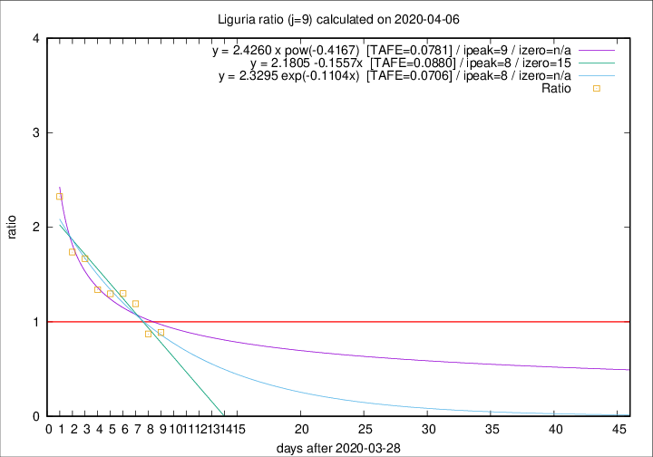

# Liguria

Data source: https://raw.githubusercontent.com/pcm-dpc/COVID-19/master/dati-json/dpc-covid19-ita-regioni.json

Delta days analysis (j): 9

Analyses for other values of j for 2020-04-06 are avalable [here](../2020-04-06/README.md)

Analyses for Liguria for previous dates are avalable [here](../README.md)

## Fitting 
|fit type|best fit equation|tafe|tfe|ipeak|izero|
|-------|-----|--------|------|---|---|
|linear|y = 2.1805 -0.1557x  [TAFE=0.0880]|0.0880|0.0045|8|15|
|exp|y = 2.3295 exp(-0.1104x)  [TAFE=0.0706]|0.0706|0.0033|8|n/a|
|pow|y = 2.4260 x pow(-0.4167)  [TAFE=0.0781]|0.0781|0.0039|9|n/a|

## Data
|Date|Daily deaths|Cumulated deaths|Deaths in the last 9 days|Deaths in the 9 days before|ratio|
|----|----------|-----------|-------|--------------------|-----|
|2020-04-06|39|595|237|267|0.8876|
|2020-04-05|14|556|225|258|0.8721|
|2020-04-04|23|542|262|220|1.1909|
|2020-04-03|31|519|265|204|1.2990|
|2020-04-02|28|488|257|198|1.2980|
|2020-04-01|32|460|248|185|1.3405|
|2020-03-31|31|428|257|154|1.6688|
|2020-03-30|20|397|245|141|1.7376|
|2020-03-29|19|377|258|111|2.3243|

[Download data as CSV](COVID-19_liguria_j9_2020-04-06.csv)

Generated April 16th, 2020 at 20:09:19 UTC+0200 with https://github.com/robianc/COVID-19
