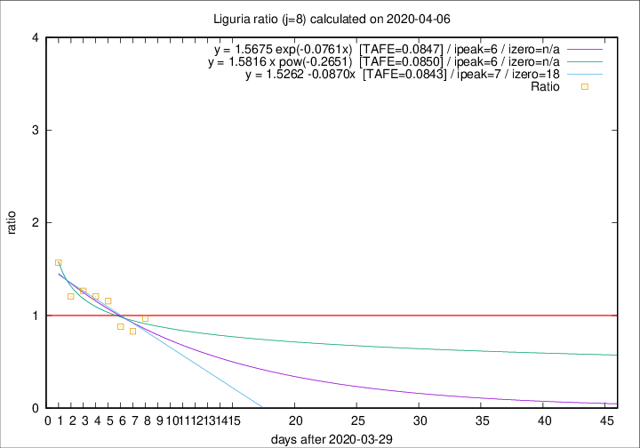

# Liguria

Data source: https://raw.githubusercontent.com/pcm-dpc/COVID-19/master/dati-json/dpc-covid19-ita-regioni.json

Estimates in this page were made on 12/4/2020 with data available until 06/04/2020.

## Summary 

### Peak estimate 
|j|linear [TAFE]|exponential [TAFE]|power law [TAFE]|details|
|---|----|-----------|---------|-------|
|7|5/4/2020 [TAFE=0.0853]|5/4/2020 [TAFE=0.0846]|4/4/2020 [TAFE=0.0789]|[analysis](COVID-19_liguria_j7_2020-04-06.md)|
|8|6/4/2020 [TAFE=0.0843]|5/4/2020 [TAFE=0.0847]|5/4/2020 [TAFE=0.0850]|[analysis](COVID-19_liguria_j8_2020-04-06.md)|
|9|6/4/2020 [TAFE=0.0880]|6/4/2020 [TAFE=0.0706]|7/4/2020 [TAFE=0.0781]|[analysis](COVID-19_liguria_j9_2020-04-06.md)|
|10|6/4/2020 [TAFE=0.2028]|7/4/2020 [TAFE=0.1007]|9/4/2020 [TAFE=0.0639]|[analysis](COVID-19_liguria_j10_2020-04-06.md)|
|11|6/4/2020 [TAFE=0.2054]|8/4/2020 [TAFE=0.0822]|13/4/2020 [TAFE=0.1222]|[analysis](COVID-19_liguria_j11_2020-04-06.md)|
|12|6/4/2020 [TAFE=0.2434]|9/4/2020 [TAFE=0.0581]|18/4/2020 [TAFE=0.1882]|[analysis](COVID-19_liguria_j12_2020-04-06.md)|
|13|6/4/2020 [TAFE=0.4686]|9/4/2020 [TAFE=0.0694]|21/4/2020 [TAFE=0.1825]|[analysis](COVID-19_liguria_j13_2020-04-06.md)|
|14|6/4/2020 [TAFE=0.5708]|10/4/2020 [TAFE=0.0852]|29/4/2020 [TAFE=0.2919]|[analysis](COVID-19_liguria_j14_2020-04-06.md)|

Best estimator is exp with j=12 (TAFE=0.0581)
Corresponding peak date estimate is 9/4/2020 (ipeak 14)

Peak date range estimate: 30/3/2020 - 1/5/2020

### End estimate 
|j|linear [TAFE/TFE]|exponential [TAFE/TFE]|power law [TAFE/TFE]|details|
|---|----|-----------|---------|-------|
|7|3/5/2020 [TAFE=0.0853]|-|-|[analysis](COVID-19_liguria_j7_2020-04-06.md)|
|8|17/4/2020 [TAFE=0.0843]|-|-|[analysis](COVID-19_liguria_j8_2020-04-06.md)|
|9|-|-|-|[analysis](COVID-19_liguria_j9_2020-04-06.md)|
|10|-|-|-|[analysis](COVID-19_liguria_j10_2020-04-06.md)|
|11|-|-|-|[analysis](COVID-19_liguria_j11_2020-04-06.md)|
|12|-|-|-|[analysis](COVID-19_liguria_j12_2020-04-06.md)|
|13|-|-|-|[analysis](COVID-19_liguria_j13_2020-04-06.md)|
|14|-|-|-|[analysis](COVID-19_liguria_j14_2020-04-06.md)|

Best estimator is linear with j=8 (TAFE=0.0843)
Corresponding end date estimate is 17/4/2020 (izero 18)

End date range estimate: 30/3/2020 - 2/5/2020

Generated April 12th, 2020 at 16:28:18 UTC+0200 with https://github.com/robianc/COVID-19
