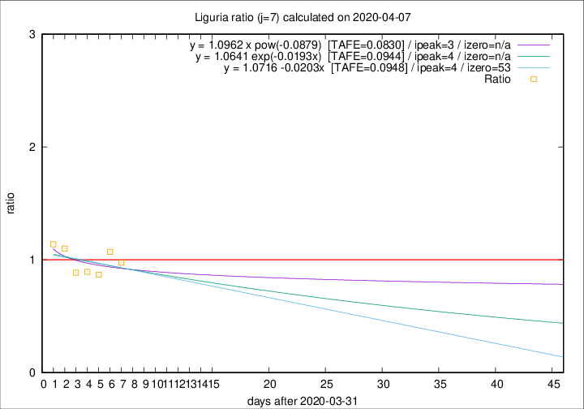

# Liguria

Data source: https://raw.githubusercontent.com/pcm-dpc/COVID-19/master/dati-json/dpc-covid19-ita-regioni.json

Delta days analysis (j): 7

## Fitting 
|fit type|best fit equation|tafe|tfe|ipeak|izero|
|-------|-----|--------|------|---|---|
|linear|y = 1.0716 -0.0203x  [TAFE=0.0948]|0.0948|0.0095|4|53|
|exp|y = 1.0641 exp(-0.0193x)  [TAFE=0.0944]|0.0944|0.0048|4|n/a|
|pow|y = 1.0962 x pow(-0.0879)  [TAFE=0.0830]|0.0830|0.0039|3|n/a|

## Data
|Date|Daily deaths|Cumulated deaths|Deaths in the last 7 days|Deaths in the 7 days before|ratio|
|----|----------|-----------|-------|--------------------|-----|
|2020-04-07|25|620|192|197|0.9746|
|2020-04-06|39|595|198|185|1.0703|
|2020-04-05|14|556|179|206|0.8689|
|2020-04-04|23|542|184|206|0.8932|
|2020-04-03|31|519|188|212|0.8868|
|2020-04-02|28|488|208|189|1.1005|
|2020-04-01|32|460|206|181|1.1381|

[Download data as CSV](COVID-19_liguria_j7_2020-04-07.csv)

Generated April 8th, 2020 at 23:43:36 UTC+0200 with https://github.com/robianc/COVID-19
